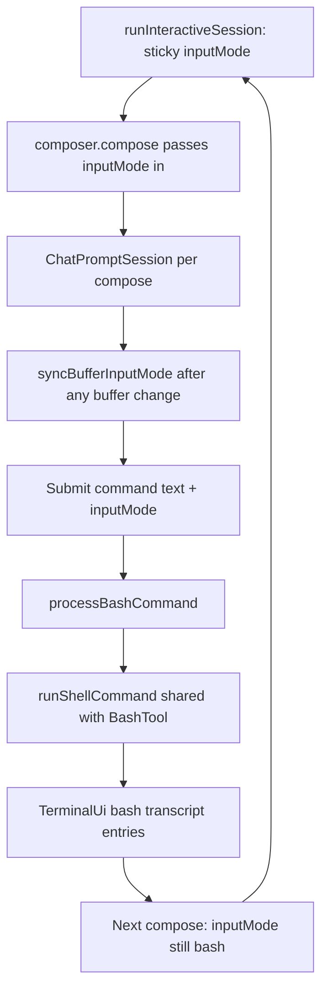

# REPL bash mode (`!`)

## Goal

When the user types `!` at the start of the prompt, switch into **sticky bash mode**: show a `!` indicator, strip the leading `!` from the editable buffer, and on submit run the command locally (same shell runner as the agent `bash` tool) and render output in the transcript **without** calling `streamAssistantTurn` / `ContextManager.beginUserTurn`.



## Current baseline

| Piece | Today |
|-------|--------|
| Input routing | [`handleInteractiveSubmission`](src/index.ts) chains slash handlers then [`handleChatSubmission`](src/index.ts) → agent turn |
| Shell execution | [`BashTool.execute`](src/tools/bash.ts) via `execFile("/bin/sh", ["-c", cmd])` |
| Prompt lifecycle | [`createChatPromptSession`](src/ui/chatPromptSession.ts) is created per [`compose()`](src/ui/promptComposer.ts) and cleaned up on submit — **no cross-compose session state** |
| Bash timeout CLI | `--bash-timeout-ms` → `loadRuntimeConfig` → `BashTool` via [`manifest.ts`](src/tools/manifest.ts); REPL path does not exist yet |
| User line in transcript | Retained TTY leaves submitted text in the prompt zone; [`persistSubmittedInput`](src/ui/terminal.ts) intentionally skips duplicate `user_message` |
| Escape cancel | [`turnCancelListener`](src/ui/turnCancelListener.ts) for **agent turns** only |

No `inputMode` / bash routing exists yet.

## Design decisions (locked)

- **Sticky mode**: type `!` once to enter; subsequent lines submit raw commands without repeating `!`.
- **Sticky state owner**: `inputMode` lives in **`runInteractiveSession`** loop state, **not** in `ChatPromptSession`. Each `compose()` creates a fresh session; the loop passes `inputMode` in via `PromptRequest` and updates it from `PromptResultSubmitted.inputMode` on submit. (`createPromptComposer` does not own sticky mode unless we explicitly move ownership there later.)
- **Reuse shell runner**: extract shared `runShellCommand` from `BashTool`; REPL and agent tool share timeout/maxBuffer/env/cwd semantics.
- **No agent / no context**: bash submissions must not call `runInteractiveTurn`, `agent.streamChat`, or `contextManager.beginUserTurn`.
- **Independent of `/tools`**: REPL bash is a direct user shell action; do not gate on `agent.isToolEnabled("bash")`.
- **Interactive TTY only (v1)**: custom `ChatPromptSession` path; readline fallback and piped stdin unchanged.
- **Sandbox**: no per-command sandbox flag; commands run in the current process environment (including Docker `--sandbox` wrapper if the whole CLI is containerized).
- **Slash commands in bash mode**: when `inputMode === "bash"`, route **only** to bash execution (`/help` runs as shell text, not [`handleHelpSubmission`](src/index.ts)).

## Implementation

### 1. Input mode helpers — new [`src/ui/inputModes.ts`](src/ui/inputModes.ts)

```ts
export type InputMode = "prompt" | "bash";

export function getModeFromInput(input: string): InputMode;
export function getValueFromInput(input: string): string; // strips one leading !
```

**`applyInputModeFromBuffer(currentMode, buffer)`** (name flexible): if `currentMode === "prompt"` and `getModeFromInput(buffer) === "bash"`, return `{ inputMode: "bash", buffer: getValueFromInput(buffer), cursorAdjusted }`. Otherwise return unchanged. Used everywhere the buffer is replaced, not only on printable first-char input.

### 2. Sticky `inputMode` ownership

**Owner: [`runInteractiveSession`](src/index.ts)** — `let inputMode: InputMode = "prompt"` in the REPL loop.

```ts
const nextInput = await composer.compose({
  mode: "chat",
  inputMode, // loop passes prior mode into each compose()
  promptText:
    inputMode === "bash" ? ui.bashPrompt() : ui.chatPrompt(),
  footer:
    inputMode === "bash" ? getBashFooterText(...) : getIdleFooterText(...),
});

if (nextInput.status === "submitted") {
  inputMode = nextInput.inputMode; // sticky across compose()
  // ...
}
```

**Prompt prefix — [`TerminalUi.bashPrompt()`](src/ui/terminal.ts)**: mirror [`chatPrompt()`](src/ui/terminal.ts) — `applyStyle("! ", formatInputPrompt)` so plain/json/no-color behavior stays consistent. `runInteractiveSession` passes `ui.bashPrompt()` as `PromptRequest.promptText` when `inputMode === "bash"`. `ChatPromptSession` still renders `request.promptText` (no separate bash prefix path inside the session beyond that).

**[`src/ui/promptState.ts`](src/ui/promptState.ts)**

- Extend **`PromptRequest`** with `inputMode?: InputMode` (default `"prompt"`).
- Add `inputMode: InputMode` to **`PromptState`** (synced to retained TTY via `renderState`).
- Seed `createPromptState(request)` with `inputMode` from request.

**[`src/ui/promptComposer.ts`](src/ui/promptComposer.ts)**

- Extend `PromptResultSubmitted`: `{ status: "submitted"; text: string; inputMode: InputMode }`.
- `settlePending` passes through `inputMode` from the active chat session (session reads initial mode from request, may update during editing, returns final mode on submit).
- Composer is **not** sticky by itself; it only forwards `inputMode` on the request/result boundary.

### 3. Buffer sync and mode detection — [`src/ui/chatPromptSession.ts`](src/ui/chatPromptSession.ts)

`ChatPromptSession` holds **working** `inputMode` initialized from `request.inputMode`, but persistence across `compose()` calls is the **`runInteractiveSession` loop** above.

**Central helper** `syncBufferInputMode()` — call after **any** buffer replacement or bulk insert:

| Trigger | Notes |
|---------|--------|
| `insertText` | typing, paste |
| `selectHistoryEntry` | Up/Down history |
| `acceptHistorySearch` / reverse search selection | same as history |
| `openPromptEditor` return | editor handoff |
| `request.defaultValue` | initial buffer on compose |
| Delete/backspace | if user removes leading content and buffer no longer implies bash, optionally stay in bash mode until Escape (prefer: **stay in bash mode** until explicit Escape; only auto-enter via `getModeFromInput`, do not auto-exit on buffer edit) |

**Enter bash mode rule**: after sync, if `inputMode === "prompt"` and `getModeFromInput(buffer) === "bash"`, set `inputMode = "bash"` and replace buffer with `getValueFromInput(buffer)` (strip one leading `!`), fix cursor.

**Prompt prefix**: when `inputMode === "bash"`, `request.promptText` is already `ui.bashPrompt()` (`"! "` styled); session renders it like the chat prompt.

**Submit**: `callbacks.submit(buffer, inputMode)`.

**Exit bash mode** (prompt open, no search/typeahead): **Escape** → set `inputMode = "prompt"`, re-render. Does not cancel agent turns ([`turnCancelListener`](src/ui/turnCancelListener.ts) remains separate).

### 4. History replay

**Persistence** ([`promptHistory.ts`](src/ui/promptHistory.ts), live history in composer):

- Store bash commands as `!${command}` so entries are self-describing in the history file.

**Replay** (`selectHistoryEntry`, reverse search accept):

1. Set `buffer` from history entry.
2. Run `syncBufferInputMode()` so `!cmd` → `inputMode = "bash"`, visible buffer `cmd` (no leading `!`).
3. Re-render with bash prompt prefix.

Without step 2–3, Up-arrow replay shows `!pwd` in the buffer or submits as chat with a literal `!`.

**Tests required**: Up-arrow history into `!cmd` entry; reverse search selecting `!git status`; assert `inputMode === "bash"`, buffer without `!`, submit routes to `processBashCommand`.

### 5. Shell runner extraction — [`src/tools/bash.ts`](src/tools/bash.ts)

Extract `runShellCommand` used by both `BashTool.execute` and REPL.

**Behavior parity** (must match current [`BashTool.execute`](src/tools/bash.ts) ~L108–170):

| Behavior | Detail |
|----------|--------|
| Shell | `/bin/sh -c <command>` |
| `cwd` | default `process.cwd()` |
| `env` | `{ ...process.env, ...overrides }` |
| `timeout` | clamp to max; on kill → `exitCode: -1`, stderr `"Command timed out and was killed"` |
| `maxBuffer` | `toolOutputInlineLimit * 2` (BashTool today uses its own `outputInlineLimit` field, fed from the same runtime value via manifest) |
| Non-zero exit | return stdout/stderr from child, non-zero `exitCode` (not throw) |

**Implementation strategy**

- Default path: keep `execFile` behavior for `BashTool` when no `AbortSignal` (minimal agent-tool regression risk).
- When `abortSignal` is provided (REPL): use `spawn` + collect stdout/stderr separately; kill child on abort; **preserve exit/timeout/killed semantics above**.
- **Stdout/stderr ordering**: separate buffers **do not preserve interleaving** (same as `execFile` today). Document in code comment; do not claim TTY-faithful ordering unless we later stream combined output.

**Manual abort (Escape during `processBashCommand`)** — distinct from timeout:

| Cause | `exitCode` | `stderr` (when no other stderr) |
|-------|------------|----------------------------------|
| Timeout | `-1` | `"Command timed out and was killed"` |
| User abort (`abortSignal`) | `-1` | `"Command cancelled"` |
| Shell non-zero | actual code | child's stderr |

`runShellCommand` should set `aborted: true` (or rely on `signal.aborted`) so `processBashCommand` does not treat cancellation as a generic tool failure. Partial stdout collected before kill is still passed to `ui.bashOutput`.

### 6. Runtime config — single resolved object (no second load)

Today [`runConfiguredSession`](src/index.ts) calls `loadRuntimeConfig()` **without** CLI overrides (artifact retention only), while [`createInitializedAgent`](src/index.ts) calls `loadRuntimeConfig({ cliOverrides: { bashDefaultTimeoutMs: parsedArgs.flags.bashTimeoutMs, ... } })`. A plain second `loadRuntimeConfig()` inside `runInteractiveSession` would **miss** `--bash-timeout-ms`.

**Fix at startup** (one resolved config):

```ts
// runConfiguredSession
const runtimeConfig = loadRuntimeConfig({
  cliOverrides: {
    maxIterations: parsedArgs.flags.maxIterations,
    maxRetries: parsedArgs.flags.maxRetries,
    bashDefaultTimeoutMs: parsedArgs.flags.bashTimeoutMs,
    streamIdleTimeoutMs: parsedArgs.flags.streamIdleTimeoutMs,
  },
});
pruneStaleArtifacts(sessionsDir, runtimeConfig.artifactRetentionDays);

const { agent, configPath } = await createInitializedAgent(
  parsedArgs,
  runtimeConfig, // pass through — do not reload inside
  ...
);

await runInteractiveMode({ agent, ui, configPath, runtimeConfig, ... });
```

- Refactor `createInitializedAgent` to accept the pre-built `RuntimeConfig` (or pass `bashDefaultTimeoutMs` + max fields only).
- Plumb `runtimeConfig` into `runInteractiveSession` → `processBashCommand({ timeoutMs: runtimeConfig.bashDefaultTimeoutMs, maxBuffer: runtimeConfig.toolOutputInlineLimit * 2 })`.
- Optional: `createShellRunOptionsFromRuntimeConfig(config)` beside `runShellCommand` returning `{ timeoutMs, maxBuffer: config.toolOutputInlineLimit * 2 }` for shared use by REPL and manifest.

Do **not** hardcode REPL-only defaults.

### 7. Bash command processor — new [`src/ui/processBashCommand.ts`](src/ui/processBashCommand.ts)

```ts
export interface ProcessBashCommandOptions {
  cwd?: string;
  abortSignal?: AbortSignal;
  timeoutMs?: number;
  maxBuffer?: number; // caller passes runtimeConfig.toolOutputInlineLimit * 2
}

export async function processBashCommand(
  command: string,
  ui: TerminalUi,
  options?: ProcessBashCommandOptions,
): Promise<void>
```

Behavior:

1. Trim; if empty, return silently (caller stays in bash mode).
2. `ui.setMode("running")`; optional status line (e.g. `Running: ${command}`) for retained TTY.
3. `ui.bashCommand(command)` — transcript line for the command.
4. `runShellCommand({ command, cwd: options?.cwd ?? process.cwd(), timeoutMs, maxBuffer, abortSignal })`.
5. `ui.bashOutput(stdout, stderr, exitCode)` — literal stdout/stderr; distinct stderr styling; non-zero exit called out subtly.
6. `ui.setMode("awaitingInput")` / clear status in `finally`.
7. Never touch agent/context.

**Escape cancel during bash run — listener owner: [`runInteractiveSession`](src/index.ts)** (not inside `processBashCommand`):

- `processBashCommand` does **not** take `inputStream`; it only accepts `abortSignal` (keeps the processor testable without TTY/keypress wiring).
- In the REPL loop, before `await processBashCommand(...)`:
  - `const bashAbort = new AbortController()`
  - `const bashCancelListener = createTurnCancelListener({ input: inputStream, interactiveInput, onCancel: () => bashAbort.abort("escape") })` (reuse existing listener module or a thin `createBashCancelListener` wrapper with the same attach/detach/`input.resume()` rules)
  - `attach()` → `try { await processBashCommand(..., { abortSignal: bashAbort.signal, maxBuffer: runtimeConfig.toolOutputInlineLimit * 2, ... }) } finally { detach() }`
- Only active while bash is running (not during `compose`, not during `runInteractiveTurn` — those keep existing Escape semantics).
- On abort: `runShellCommand` returns `exitCode: -1`, stderr `"Command cancelled"` (manual-abort table above).
- **`detach()` pauses stdin** ([`turnCancelListener.ts`](src/ui/turnCancelListener.ts) ~L88–90). That matches agent-turn cancel; the next REPL iteration immediately calls `composer.compose()`, which resumes stdin for the prompt. No extra resume in the bash path unless a test shows a gap.

**JSON mode (`--json`)**: be explicit — either emit structured events (`bash_command`, `bash_stdout`, `bash_stderr`, `bash_exit`) or document that bash is disabled in JSON mode. **Do not** no-op all UI methods silently (today many `TerminalUi` methods return early when `json` is true, which would make interactive bash appear to do nothing). Prefer: if `ui.isJsonMode()`, write JSON lines to stdout for bash lifecycle; if unsupported in v1, reject/warn once at REPL start.

### 8. Transcript rendering and retained-prompt dedup

**[`src/ui/replUi.ts`](src/ui/replUi.ts)** — new kinds: `bash_command`, `bash_stdout`, `bash_stderr` (or single `bash_output` if simpler).

**[`src/ui/transcriptRenderer.ts`](src/ui/transcriptRenderer.ts)** + [`transcriptEntryOps.ts`](src/ui/transcriptEntryOps.ts):

- `bashCommand`: prefix `! ` (styled like input prompt).
- stdout/stderr: raw lines, stderr uses warning/subtle color.

**[`src/ui/terminal.ts`](src/ui/terminal.ts)**: `bashCommand`, `bashOutput`; respect JSON policy above.

Do **not** call `persistSubmittedInput` on the bash path.

**Retained TTY — avoid duplicate command line**: on submit, [`settlePending`](src/ui/promptComposer.ts) calls `renderState(null)`, which clears the live prompt from the retained bottom zone before `processBashCommand` runs. The submitted command is **not** left visible in the prompt renderer; `ui.bashCommand(command)` is the durable transcript line. **Test explicitly**: after bash submit on retained TTY, transcript contains exactly one `bash_command` entry for that command (no ghost line in the former prompt slot). If implementation order changes, ensure prompt clear happens before `bashCommand` append.

### 9. Route in REPL loop — [`src/index.ts`](src/index.ts)

`runInteractiveSession` signature gains `runtimeConfig` (same object used to build the agent).

```ts
if (nextInput.status === "submitted" && nextInput.inputMode === "bash") {
  const bashAbort = new AbortController();
  const bashCancelListener = createTurnCancelListener({
    input: inputStream,
    interactiveInput,
    onCancel: () => bashAbort.abort("escape"),
  });
  bashCancelListener.attach();
  try {
    await processBashCommand(nextInput.text.trim(), ui, {
      cwd: process.cwd(),
      abortSignal: bashAbort.signal,
      timeoutMs: runtimeConfig.bashDefaultTimeoutMs,
      maxBuffer: runtimeConfig.toolOutputInlineLimit * 2,
    });
  } finally {
    bashCancelListener.detach();
  }
  continue; // skip handleInteractiveSubmission — /help is shell text, not slash
}

await handleInteractiveSubmission(trimmedInput, ...);
```

Update [`getIdleFooterText`](src/ui/slashCommands.ts) / help: `!` enter bash; `Esc` exit bash (prompt) vs cancel turn (agent running).

### 10. [`src/ui/replRenderer.ts`](src/ui/replRenderer.ts)

- Footer when `prompt?.mode === "chat"` (includes bash — bash still uses `mode: "chat"`).
- Retained prompt shows `inputMode` and `!` prefix via `PromptState`.

## Tests

| Area | Cases |
|------|--------|
| `inputModes.test.ts` | `getModeFromInput`, `getValueFromInput`, `applyInputModeFromBuffer` |
| `chatPromptSession.test.ts` | type `!` enters bash; **paste** `!pwd`; editor return with `!cmd`; Escape exits |
| `promptComposer.test.ts` | submit includes `inputMode`; **second `compose({ inputMode: "bash" })` opens with bash prefix** (caller passes prior returned mode — composer is not sticky alone) |
| `index` / session loop | **sticky across two iterations**: first submit returns `inputMode: "bash"`; loop variable updated; second iteration passes bash into `compose` without retyping `!` |
| History | Up-arrow `!cmd` → bash mode + buffer `cmd`; reverse search same |
| `processBashCommand.test.ts` | mock `runShellCommand`; cwd option; `setMode("running")` / clear; nonzero exit; timeout (`"Command timed out and was killed"`); abort (`"Command cancelled"`, `exitCode: -1`) |
| `runShellCommand` / `BashTool` | parity: env merge, killed/timeout message, maxBuffer truncation |
| `index` / integration | `/help` in bash mode does not call `handleHelpSubmission`; no `streamChat` |
| Retained TTY | single `bash_command` transcript line after submit (no duplicate with cleared prompt) |
| Large output | truncation message in stderr |
| Runtime config | REPL passes `timeoutMs: runtimeConfig.bashDefaultTimeoutMs` and `maxBuffer: runtimeConfig.toolOutputInlineLimit * 2` (test with `--bash-timeout-ms` override in index test) |
| Bash Escape / session loop | Escape during bash run aborts command (`"Command cancelled"`); after `detach()` (stdin paused), next `compose()` still accepts input (regression for pause/resume handoff) |

Use [`ttyTestStream.ts`](src/ui/__tests__/ttyTestStream.ts) / [`promptComposerTestHelpers.ts`](src/ui/__tests__/promptComposerTestHelpers.ts).

## Out of scope (v1)

- Inline `` !`cmd` `` in chat prompts.
- PowerShell / `$SHELL` login shell (stay `/bin/sh -c`).
- Submit-while-agent-busy queue.
- Non-TTY sticky `!` mode.
- Combined stdout/stderr interleaving.

## Risk notes

- **stdin ownership**: bash cancel listener lives in `runInteractiveSession` (same attach/detach/`input.resume()` rules as [`turnCancelListener`](src/ui/turnCancelListener.ts)); `detach` in `finally` pauses stdin — verify next `compose()` works (session-loop test); never overlap turn listener or an active `compose()` session.
- **Escape precedence**: search/typeahead → exit bash mode (prompt) → cancel turn (agent) → cancel bash command (while `processBashCommand` running).
- **Compose lifecycle**: regressions happen if `inputMode` is only stored on `ChatPromptSession` — test sticky via the **session loop** (or explicit `inputMode` on second `compose` in composer tests), not composer-internal stickiness.
- **History without sync**: replaying `!cmd` without `syncBufferInputMode` is a common bug — cover in tests.

## Files to touch (focused)

| File | Change |
|------|--------|
| [`src/ui/inputModes.ts`](src/ui/inputModes.ts) | **New** — detect + strip + apply |
| [`src/ui/processBashCommand.ts`](src/ui/processBashCommand.ts) | **New** |
| [`src/tools/bash.ts`](src/tools/bash.ts) | `runShellCommand` + spawn abort path |
| [`src/ui/promptState.ts`](src/ui/promptState.ts) | `inputMode` on `PromptRequest` / `PromptState` |
| [`src/ui/promptComposer.ts`](src/ui/promptComposer.ts) | Pass-through `inputMode` on result (not sticky owner) |
| [`src/ui/chatPromptSession.ts`](src/ui/chatPromptSession.ts) | `syncBufferInputMode`, history/editor/paste |
| [`src/index.ts`](src/index.ts) | Single `loadRuntimeConfig` + plumb; sticky loop; bash branch |
| [`src/config/runtimeConfig.ts`](src/config/runtimeConfig.ts) | (types only if shell-options helper added) |
| [`src/ui/terminal.ts`](src/ui/terminal.ts) | `bashPrompt`, `bashCommand`, `bashOutput`; JSON policy |
| [`src/ui/transcriptRenderer.ts`](src/ui/transcriptRenderer.ts) | Renderers |
| [`src/ui/transcriptEntryOps.ts`](src/ui/transcriptEntryOps.ts) | New kinds |
| [`src/ui/replUi.ts`](src/ui/replUi.ts) | Transcript types |
| [`src/ui/slashCommands.ts`](src/ui/slashCommands.ts) | `getBashFooterText`, help |
| [`src/ui/turnCancelListener.ts`](src/ui/turnCancelListener.ts) | Reuse for bash-run Escape (or thin wrapper) |
| Tests | See table above |

## Validation

Per [AGENTS.md](../AGENTS.md): `npm test`, `npm run build`, `npx fallow audit`.
