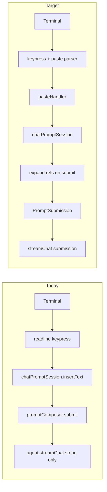

# Paste, drop, and clipboard support for propio

## Scope

**Initial ship (this effort):** bracketed paste, paste handler, large-text collapse, image path drag/paste, rich submission through the interactive loop, agent multimodal wiring.

**Deferred (follow-up):** macOS clipboard-image on empty paste, paste-cache history for entries >1024 chars, optional `sharp` for resize/BMP conversion. See [Phase 5 (deferred)](#phase-5-deferred--clipboard-image--paste-cache-history).

## Current state

Propio’s interactive prompt is a **raw-mode, readline keypress** editor in [`src/ui/chatPromptSession.ts`](src/ui/chatPromptSession.ts). Printable input goes straight to `insertText()`; Enter submits immediately. There is **no** bracketed-paste (DEC mode 2004), no paste-vs-type distinction, and no placeholder/collapse for large pastes.

Downstream, [`src/agent.ts`](src/agent.ts) calls `contextManager.beginUserTurn(userMessage)` with **string content only** ([`src/context/contextManager.ts`](src/context/contextManager.ts) L324–331), even though `ChatMessage` and session persistence already support `images` ([`src/providers/types.ts`](src/providers/types.ts) L24, [`src/context/persistence.ts`](src/context/persistence.ts)). `@file` mentions are resolved via [`src/fileSearch/attachmentResolver.ts`](src/fileSearch/attachmentResolver.ts) on submit—not via paste/drop.

Today [`PromptResultSubmitted`](src/ui/promptComposer.ts) is only `{ status, text, inputMode }`, and the REPL trims that to a string at [`src/index.ts`](src/index.ts) L721–723 before routing.



## Target architecture

| Layer | Responsibility | New / changed location |
|-------|----------------|------------------------|
| Terminal control | Enable/disable bracketed paste on injectable TTY stream | `src/ui/input/bracketedPaste.ts` |
| Stdin / keypress parser | Collect `CSI 200~` … `201~`; emit atomic paste events | `src/ui/input/parseKeypress.ts` |
| Paste hook | Detect paste (bracketed, >800 chars, path-shaped, split chunks); 100ms batch | `src/ui/input/pasteHandler.ts` |
| Path parsing | Quoted paths, `file://`, escaped spaces, macOS drag formats | `src/ui/input/parseDroppedPaths.ts` |
| Prompt input | Insert text/images; block Enter while pasting; render pills | [`src/ui/chatPromptSession.ts`](src/ui/chatPromptSession.ts) |
| Submit | Expand registered placeholder tokens → `PromptSubmission` | `src/ui/input/expandSubmit.ts`, [`src/ui/promptComposer.ts`](src/ui/promptComposer.ts) |
| Agent | Attach images on user turn; keep @mention resolver | [`src/agent.ts`](src/agent.ts), [`src/context/contextManager.ts`](src/context/contextManager.ts) |
| History (deferred) | Paste-cache for huge entries | `src/ui/pasteCache.ts` — Phase 5 |

**Terminal control stream:** Prompt rendering uses **stderr** ([`src/ui/terminal.ts`](src/ui/terminal.ts)), but bracketed-paste mode must be written to the **controlling terminal** (usually stdout). Do **not** hardcode `process.stdout` inside `chatPromptSession`:

- Add `terminalControlStream?: NodeJS.WriteStream` to `ChatPromptSessionOptions` / `PromptComposerOptions`, defaulting to `process.stdout`.
- Call `enableBracketedPaste(stream)` only when `stream.isTTY`.
- Always `disableBracketedPaste` in `cleanup()` ([`chatPromptSession.ts`](src/ui/chatPromptSession.ts) L1729) even if enable was skipped (idempotent).
- Tests inject a mock stream and assert disable-on-cleanup.

## Rich submission object (define early)

Introduce a single payload type used end-to-end **before** image/path features land, so later phases only fill fields.

**Module placement:** define `PromptSubmission` and `PromptImage` in a small shared module, e.g. [`src/ui/input/promptSubmission.ts`](src/ui/input/promptSubmission.ts) (export `isSubmissionEmpty` there too). **Do not** put these types in [`promptComposer.ts`](src/ui/promptComposer.ts) — [`index.ts`](src/index.ts) and [`agent.ts`](src/agent.ts) both import them, and keeping types out of the composer avoids awkward UI ↔ agent cross-imports through unrelated files.

```ts
/** Runtime image bytes for providers — NOT PersistedImage (session JSON only). */
export type PromptImage = Uint8Array | string; // base64 or data URL per provider conventions

export interface PromptSubmission {
  /** Expanded text sent to the agent (placeholders resolved). */
  text: string;
  /** What the user saw in the prompt buffer (may contain pills). */
  displayText: string;
  inputMode: InputMode;
  /** Provider-ready attachments; omitted when none. */
  images?: PromptImage[];
}
```

**Pipeline changes (explicit):**

1. [`PromptResultSubmitted`](src/ui/promptComposer.ts) — replace bare `text` with `submission: PromptSubmission` (or top-level `text` + `displayText` + `images` mirroring the interface; prefer one nested object).
2. [`settlePending`](src/ui/promptComposer.ts) — run `expandPastedRefs(displayText, pastedContents)` → build `PromptSubmission`; history `record()` per [History policy](#history-policy-mvp) below.
3. [`runInteractiveSession`](src/index.ts) — pass `PromptSubmission` into bash vs chat branches; use [empty-submission rule](#empty-submissions) (do not drop image-only turns).
4. [`handleInteractiveSubmission`](src/index.ts) — accept `PromptSubmission`; slash handlers use `submission.text` (expanded); same empty rule.
5. [`Agent.streamChat`](src/agent.ts) — `streamChat(submission: PromptSubmission, …)` or `(text, options?: { images })`; `beginUserTurn` receives runtime images.

`PersistedImage` (`{ data, encoding }`) stays in [`src/context/persistence.ts`](src/context/persistence.ts) for save/load only. Conversion: `PromptImage[]` → `ChatMessage.images` at turn creation; persistence layer maps to `PersistedImage` when writing sessions (existing `persistImage` helpers).

## Bash mode and slash commands

| Context | Image path paste/drop | Large text paste |
|---------|----------------------|------------------|
| **Chat (`inputMode: "prompt"`)** | Read image → `[Image #N]` pill + `images` on submit | Collapse to `[Pasted text #N]` when over threshold |
| **Bash (`inputMode: "bash"`)** | **No image pills** — insert path string literally (shell may use the file) | Same collapse rules as chat, or literal insert if under threshold |

**Slash commands:** Before handler chain in `handleInteractiveSubmission`, if `submission.text` matches a slash command pattern (`/^\/\w+/`) **and** `submission.images?.length > 0`:

- **Reject** with a clear error: e.g. `Images cannot be sent with slash commands.` (do not attach images to `/help`, `/model`, etc.)
- Do not pass `images` into skill/session handlers.

Chat turns (`handleChatSubmission` / default agent path) receive full `PromptSubmission` including `images`.

## Empty submissions

Today [`handleInteractiveSubmission`](src/index.ts) returns early when `!trimmedInput`, and the REPL derives `trimmedInput` from `nextInput.text.trim()` — that **drops image-only** submissions (e.g. drag an image with no caption).

**Rule:** treat a submission as empty only when **both** are true:

```ts
function isSubmissionEmpty(submission: PromptSubmission): boolean {
  return (
    submission.text.trim() === "" &&
    (submission.images?.length ?? 0) === 0
  );
}
```

- Replace `if (!trimmedInput)` (and equivalent checks) with `if (isSubmissionEmpty(submission))`.
- Image-only: `text` may be `""` after expansion (image tokens removed or replaced with markers — see below); `images` must still flow to `streamChat` / `beginUserTurn`.
- Bash mode: same rule; image-only bash submissions are unusual but must not vanish if we ever attach images there in chat-only paths — bash stays path-string-only for drops.

## History policy (MVP)

Until paste-cache (Phase 5), avoid bloating [`prompt-history.json`](src/ui/promptHistory.ts):

| Condition | `historyStore.record()` |
|-----------|-------------------------|
| Expanded `submission.text` length ≤ `HISTORY_INLINE_MAX` (1024) | Record expanded `text` (normal behavior) |
| Expanded `submission.text` length > `HISTORY_INLINE_MAX` | **Skip** history entry for this submit |
| Image-only (`text` empty, has `images`) | Skip history (nothing meaningful to recall) or record a short sentinel like `[image submission]` — **prefer skip** for MVP |

Do **not** record multi‑KB expanded paste bodies inline while paste-cache is deferred. Phase 5 will record `paste:<hash>` and restore on up/down.

`displayText` (with pills) is never written to history.

## Placeholder expansion policy

Placeholders are **registry tokens**, not free-form editable abbreviations.

- **Canonical pill forms** in the buffer: `[Pasted text #N]`, `[Pasted text #N +M lines]`, `[Image #N]` — stored in `pastedContents: Map<number, PastedContent>`.
- **On submit — scan the full buffer:** Tokens may appear **inline** amid other text (e.g. `fix this [Pasted text #1] please`). Do **not** use a whole-string anchored regex. Use either:
  - A **global token lexer** that finds non-overlapping matches of `\[(?:Pasted text|Image) #\d+(?: \+\d+ lines)?\]` at token boundaries, or
  - `displayText.replaceAll` with a **boundary-aware** pattern (same character class, `g` flag), replacing each match independently left-to-right.
- **Text pills:** replace token with full pasted string from registry.
- **Image pills:** replace token in `submission.text` with a **harmless textual marker**, e.g. `[Attached image: photo.png]` (basename from registry). **Do not** embed base64 in `text`. Binary payload goes only in `submission.images`.
- **Image ordering (fixed rule):** `submission.images` follows **left-to-right token order in `displayText`** as tokens are scanned (not numeric id sort). Matches user intent when they type between multiple `[Image #N]` pills. Tests in `expandSubmit.test.ts` must assert order for e.g. `[Image #2] then [Image #1]` in the buffer.
  - Alternative acceptable for MVP: remove image tokens entirely and rely on `images` only; if so, image-only submits yield `text === ""` and depend on [empty-submission rule](#empty-submissions). **Preferred:** marker string so the model sees a filename hint.
- Unrecognized ids / malformed tokens → leave literal in output; debug log only.
- **User edits:** Split, duplicate, or partial tokens no longer match → literal text; no fuzzy repair.
- **Manual typing:** `[Pasted text #1]` without registry entry → no expansion.
- **Implementation:** expand-at-submit only (not live buffer mutation).

## Phase 1 — Bracketed paste + keypress parser

**New modules**

- `src/ui/input/bracketedPaste.ts` — `EBP` / `DBP`, `enableBracketedPaste(stream)`, `disableBracketedPaste(stream)`.
- `src/ui/input/parseKeypress.ts` — state machine on `str` + `key.sequence`:
  - Incomplete ESC/CSI handling.
  - `PASTE_START` / `PASTE_END` → `{ kind: 'paste', text, isPasted: true }` (emit paste on end even if empty — reserved for deferred clipboard phase).
  - Else → `{ kind: 'key', str, key }`.

**Integration in `createChatPromptSession`**

- On attach: `enableBracketedPaste(options.terminalControlStream ?? process.stdout)` if TTY.
- On `cleanup()`: `disableBracketedPaste` on the same stream.
- Route: `parseKeypress` → paste → `pasteHandler` → keys → existing handlers.

**Heuristic:** printable chunk `length > PASTE_THRESHOLD` (800) → paste when bracketed paste unavailable.

## Phase 2 — Paste handler (text batching + safety)

**New:** `src/ui/input/pasteHandler.ts`

Detection: `isPasted`, `length > 800`, path-shaped payload (via `parseDroppedPaths`), or `pastePendingRef` (split chunks).

Behavior:

- 100ms debounce → single `onPasteReady`.
- Clean: strip ANSI, `\r` → `\n`, tabs → spaces.
- `isPasting` → ignore `Return` in `handleEnter`.
- Callbacks: `onTextPaste`, `onImagePaths` (chat mode only for image branch).

**No `onEmptyPaste` in initial scope** (deferred with clipboard).

## Phase 3 — Large text placeholders + submit expansion

```ts
type PastedContent =
  | { id: number; type: 'text'; content: string }
  | { id: number; type: 'image'; data: PromptImage; mediaType: string; filename: string; path?: string };
```

- `PASTE_THRESHOLD = 800`.
- **Line cap for collapse** uses the **prompt render stream** (`outputStream` / `getPromptOutputStream()`), not `terminalControlStream` — that is the stream whose `rows` reflect layout for the multiline prompt:
  ```ts
  const rows = outputStream.rows ?? 24;
  const maxLines = Math.max(1, Math.min(rows - 10, 2));
  ```
  Guards tiny terminals (e.g. `rows === 5` → `maxLines === 1`).
- Over char threshold or `lineCount > maxLines` → registry token; else `insertText`.
- `expandPastedRefs` → `PromptSubmission.text` + `images`; buffer snapshot → `displayText`.
- History: [History policy (MVP)](#history-policy-mvp).

## Phase 4 — Image paths (drag-and-drop = paste paths)

**New:** `src/ui/input/imagePaste.ts`, `src/ui/input/parseDroppedPaths.ts`

**Path parsing (robust):**

- Split on newlines first; then per line use `parseDroppedPaths` that handles:
  - `file://` URLs → decode path (incl. `%20`).
  - Single-quoted and double-quoted paths (`'/path/with spaces'`, `"C:\\path with spaces"`).
  - Backslash-escaped spaces where terminals emit them.
  - macOS drag formats: bare paths, sometimes URI-encoded; strip trailing `\r`.
  - Multiple paths: whitespace only when **not** inside quotes; avoid naive `split(/ (?=\/)/)` alone.
- Unit tests: spaces in filenames, `file://`, two paths on one line, Windows `C:\` drives.

**Image handling (no required native deps):**

- Extensions: `.png`, `.jpg`, `.jpeg`, `.gif`, `.webp`; `.bmp` → reject with message to convert, unless optional `sharp` added later.
- `tryReadImageFromPath`: read file, enforce max bytes (e.g. 8 MB), validate magic bytes / extension.
- Encode as **base64 string** or `Uint8Array` in `PromptImage[]` — same as [`ChatMessage.images`](src/providers/types.ts).
- **No `sharp` in initial scope.** Optional `optionalDependencies` + feature detect in a follow-up for resize/BMP.
- Failures → fall back to literal path text in buffer.

Chat mode: `[Image #N]` pill + map entry; on submit → `[Attached image: <basename>]` in `text` + bytes in `images`. Bash mode: path string only (no pill, no `images`).

## Phase 5 (deferred) — Clipboard image + paste-cache history

**Clipboard (`src/ui/input/clipboardImage.ts`)**

- macOS: `osascript` / `pngpaste` fallback; wire `onEmptyPaste` from paste handler.
- Optional `/image-paste` or shortcut.

**Paste-cache (`src/ui/pasteCache.ts`)**

- `~/.propio/paste-cache/<hash>.txt` for history entries >1024 chars.
- Schema v2 for `prompt-history.json` with backward-compatible load.
- History up/down restores hash → content.

## Phase 6 — Agent / context multimodal wiring

1. **`beginUserTurn(content: string, images?: PromptImage[]): void`**

   ```ts
   userMessage: {
     role: 'user',
     content,
     ...(images?.length ? { images } : {}),
   }
   ```

   Use **`(Uint8Array | string)[]`** — identical to `ChatMessage.images`. Persistence converts via existing `persistMessage` when saving sessions.

2. **`Agent.streamChat`** — take `PromptSubmission` (or `text` + `images?: PromptImage[]`).

3. **`runInteractiveSession` / `handleInteractiveSubmission`** — pass submission object; apply slash/bash rules above.

4. **Providers** — unchanged; [`promptBuilder.ts`](src/context/promptBuilder.ts) pushes `turn.userMessage` as-is.

5. **Transcript** — “(N images attached)” or pills; never raw base64.

## Testing strategy

| Test file | Cases |
|-----------|--------|
| `parseKeypress.test.ts` | Bracketed boundaries, split ESC, empty paste event |
| `pasteHandler.test.ts` | 800+ heuristic, debounce, bash vs chat image branch |
| `parseDroppedPaths.test.ts` | Quotes, `file://`, spaces, Windows paths, multi-path |
| `imagePaste.test.ts` | Read limits, unsupported type, fallback to path text |
| `expandSubmit.test.ts` | Inline tokens, image→marker + `images`, broken tokens literal, image-only expand |
| `index.test.ts` or composer | `isSubmissionEmpty` — image-only not ignored |
| `promptComposer.test.ts` | Injectable `terminalControlStream`, disable on cleanup, Enter while pasting |
| `agent.test.ts` / context | `PromptSubmission.images` → `promptBuilder` messages |

Defer: `pasteCache.test.ts`, clipboard mocks until Phase 5.

## Validation

`npm test`, `npm run build`, `npm run format:check`, `npx fallow audit`.

## Risks and mitigations

| Risk | Mitigation |
|------|------------|
| readline mangles CSI | `key.sequence` + buffer; literal sequence tests |
| Hardcoded stdout | Injectable `terminalControlStream` + tests |
| Placeholder ambiguity | Registry + global token scan; no fuzzy expand |
| Image-only submit dropped | `isSubmissionEmpty` requires empty text **and** no images |
| History bloat before paste-cache | Skip record when expanded text > 1024 |
| Images on slash commands | Explicit reject before handler chain |
| `sharp` install friction | Not in initial scope; size/type validation only |
| Fragile path split | Dedicated `parseDroppedPaths` with quoted/URI cases |

## Implementation order (initial scope)

1. `src/ui/input/promptSubmission.ts` (`PromptSubmission`, `PromptImage`, `isSubmissionEmpty`) + wire through `PromptResult`, `index.ts`, `streamChat` (images optional/no-op).
2. Bracketed paste + parser + paste handler + Enter guard + injectable terminal stream.
3. Text placeholders + `expandPastedRefs` + registry policy.
4. `parseDroppedPaths` + image read + pills + bash/slash rules + `beginUserTurn` images.
5. Transcript polish + README (document deferred clipboard/cache).

## README (initial)

Document: bracketed paste in TTY chat; drag image files → `[Image #N]` in chat mode; paths literal in bash; large paste → `[Pasted text #N]`; size limits and supported formats. Note: clipboard image paste and history paste-cache planned separately.
