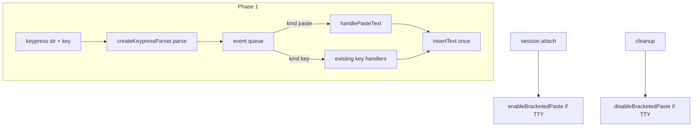

# Phase 1: Bracketed paste + keypress parser

## Goal

Deliver the **input layer** from [docs/PLAN-copy-paste-full.md](docs/PLAN-copy-paste-full.md#phase-1--bracketed-paste--keypress-parser): terminals that support DEC mode 2004 send paste as `ESC[200~` … `ESC[201~` instead of a flood of printable keypresses. Propio today inserts every printable `str` in [`handleKeypress`](src/ui/chatPromptSession.ts) (L1712–1717); Phase 1 detects paste boundaries and calls `insertText` once per paste.

**In scope:** `bracketedPaste.ts`, `parseKeypress.ts`, injectable control stream, session lifecycle, 800-char fallback heuristic, unit tests.

**Explicitly out of scope (later phases):** `PromptSubmission` / agent wiring (implementation-order step 1), debounced `pasteHandler` behavior (Phase 2), Enter-while-pasting guard (Phase 2), placeholders (Phase 3), image paths (Phase 4).



## Current baseline

| Area | Today |
|------|--------|
| Input | Raw `keypress` on stdin; printable → `insertText(str)` |
| Paste | No bracketed mode; multi-char `str` in one event (e.g. test `"!pwd"`) |
| Control TTY | Not used; render on stderr via [`promptComposer.ts`](src/ui/promptComposer.ts) L125–126 |
| `src/ui/input/` | Does not exist |

## New modules

### 1. [`src/ui/input/bracketedPaste.ts`](src/ui/input/bracketedPaste.ts)

- Export sequences (for tests): `BRACKETED_PASTE_ENABLE` = `\x1b[?2004h`, `BRACKETED_PASTE_DISABLE` = `\x1b[?2004l`.
- `enableBracketedPaste(stream: NodeJS.WriteStream): void` — write enable only if `stream.isTTY`.
- `disableBracketedPaste(stream: NodeJS.WriteStream): void` — write disable only if `stream.isTTY` (same guard as enable). Call it unconditionally from `cleanup()` so lifecycle stays symmetric; when the stream is not a TTY, the call is a no-op and does not leak escape codes into piped stdout.

### 2. [`src/ui/input/parseKeypress.ts`](src/ui/input/parseKeypress.ts)

Per-session parser via **`createKeypressParser()`** — no module-level state. Each `createChatPromptSession` call gets its own parser instance so paste/ESC prefix buffers cannot leak across tests or concurrent prompt sessions.

**Inputs:** `str`, `key` (`readline.Key`, especially `key.sequence`).

**Outputs:** an **array of parsed events** (queue), drained in order by `handleKeypress`:

```ts
type ParsedKeypress =
  | { kind: "paste"; text: string; isPasted: true }
  | { kind: "key"; str: string | undefined; key: readline.Key };

type KeypressParser = {
  parse(str: string | undefined, key: readline.Key): ParsedKeypress[];
};
```

Returning a queue avoids losing or delaying trailing keys when one readline event contains multiple logical inputs (e.g. `\x1b[200~hello\x1b[201~x` must emit paste **and** key `x` in the same turn). `handleKeypress` loops over the array and dispatches each item.

**Synthesized trailing keys:** when the parser splits a mixed sequence and emits a key that was not the original readline event (e.g. trailing `x` after `201~`), construct a predictable `readline.Key` shape:

```ts
// Printable trailing char extracted from sequence tail → ParsedKeypress:
{ kind: "key", str: "x", key: {
  ...originalKey,           // preserve shift etc. when known; otherwise defaults below
  sequence: "x",
  name: "x",                // readline name for single printable when applicable
  ctrl: false,
  meta: false,
}}
```

Use the original `key` as a base when modifiers apply; for a lone printable suffix, `ctrl`/`meta` are `false`. Navigation/special keys synthesized from CSI should copy `name`/`sequence` from readline conventions rather than inventing partial keys.

**Rules (from plan):**

| Case | Behavior |
|------|----------|
| Inside bracketed paste (`ESC[200~` … `ESC[201~`) | Accumulate body; on `201~` emit `{ kind: "paste", text, isPasted: true }` even if `text === ""` |
| Incomplete bracketed-paste prefix | Hold **only** byte prefixes that could still complete `\x1b[200~` or `\x1b[201~`; return `[]` until resolved |
| Any other ESC/CSI (arrows, Escape, etc.) | **Do not buffer** — emit `{ kind: "key", … }` immediately so lone Escape reaches `handleSearchCancelKeys()` ([`chatPromptSession.ts` L1495](src/ui/chatPromptSession.ts)) and navigation keys are not delayed |
| Normal key | `{ kind: "key", str, key }` |
| Printable `str.length > PASTE_THRESHOLD` (800) | Treat as `{ kind: "paste", … }` when not already in bracketed mode (fallback for terminals without 2004) |

**Implementation notes:**

- Prefer `key.sequence` when `str` is empty or unreliable (plan risk: readline mangles CSI).
- Bracketed markers: start `\x1b[200~`, end `\x1b[201~` (same as xterm/kitty/iTerm).
- Prefix buffer is narrowly scoped to bracketed-paste detection only — not a general CSI accumulator.
- Do **not** strip ANSI or normalize newlines here (Phase 2 `pasteHandler`).

### 3. [`src/ui/input/constants.ts`](src/ui/input/constants.ts) (small)

- `export const PASTE_THRESHOLD = 800` — shared with Phase 2+.

### Phase 1 paste delivery (no full `pasteHandler` yet)

The doc’s route shows `pasteHandler` before keys; Phase 2 owns debounce/cleaning/`isPasting`. For Phase 1, add a **thin inline path** in `chatPromptSession`:

```ts
function handlePasteText(text: string): void {
  if (text.length > 0) insertText(text);
}
```

Phase 2 will replace this with `createPasteHandler({ onTextPaste: … })` without changing `parseKeypress` boundaries.

## Integration changes

### [`ChatPromptSessionOptions`](src/ui/chatPromptSession.ts) (L58–70)

Add:

```ts
terminalControlStream?: NodeJS.WriteStream; // default process.stdout
```

### Session lifecycle in `createChatPromptSession`

1. **After** options destructuring, resolve `controlStream = options.terminalControlStream ?? process.stdout` and create `keypressParser = createKeypressParser()`.
2. **On attach** (before `inputStream.on("keypress")`): `enableBracketedPaste(controlStream)`.
3. **In `cleanup()`** (L1729–1738), **before** removing listeners: call `disableBracketedPaste(controlStream)` unconditionally (writes only when `controlStream.isTTY`).
4. **Refactor `handleKeypress`:**

```ts
const events = keypressParser.parse(str, key);
for (const parsed of events) {
  if (parsed.kind === "paste") {
    handlePasteText(parsed.text);
    continue;
  }
  const { str: keyStr, key: keyObj } = parsed;
  if (handleControlAndSystemKeys(keyStr, keyObj)) continue;
  if (handleSearchModeInput(keyStr, keyObj)) continue;
  if (handleTypeaheadAndNavigationKeys(keyStr, keyObj)) continue;
  if (isPrintableKey(keyStr, keyObj)) insertText(keyStr ?? "");
}
```

Each queued `key` event runs the **same ordered handler chain** as today’s single-event path: call each stage in order and stop for that item when a stage returns true. Do not stop the parser loop after `handleControlAndSystemKeys`; for each queued key, run the full chain until one stage handles it.

Existing handler implementations (`handleEnter`, navigation, bash `!` prefix via `insertText`, etc.) stay unchanged; only the entry point gains parsing + the loop.

### [`PromptComposerOptions`](src/ui/promptComposer.ts) (L56–72)

Add `terminalControlStream?: NodeJS.WriteStream` and pass it into `createChatPromptSession` at L298–327.

Production default: `process.stdout` (controlling terminal), **not** `outputStream` (stderr).

## Testing

| File | Cases |
|------|--------|
| **`src/ui/input/__tests__/parseKeypress.test.ts`** | Full bracketed paste; paste split across multiple `parse()` calls; empty paste (`200~` + immediate `201~`); bracketed prefix held then completed; paste + trailing key in one sequence (`200~hello201~x` → `[paste, key]` with synthesized `{ sequence: "x", name: "x", ctrl: false, meta: false }`); lone Escape / arrow keys pass through without delay; 801-char printable → `paste`; normal single char → `key` |
| **`src/ui/input/__tests__/bracketedPaste.test.ts`** | Enable/disable written on TTY mock; both skipped when `!isTTY`; `disableBracketedPaste` still safe to call on non-TTY |
| **[`src/ui/__tests__/chatPromptSession.test.ts`](src/ui/__tests__/chatPromptSession.test.ts)** | Bracketed paste inserts full buffer in one shot (use `withKeypressEvents` from [`ttyTestStream.ts`](src/ui/__tests__/ttyTestStream.ts)); mock `terminalControlStream` records EBP/DBP on attach/cleanup **only in bracketed-paste assertions** |
| **[`src/ui/__tests__/promptComposer.test.ts`](src/ui/__tests__/promptComposer.test.ts)** (optional, 1 test) | Custom chat path forwards injectable control stream |

**Test harness default:** `createTestSession()` / direct `createChatPromptSession()` tests should inject a **non-TTY** `terminalControlStream` by default (e.g. a `PassThrough` mock). Use a TTY mock with a `chunks` recorder only in tests that assert EBP/DBP writes. This prevents test runs from accidentally writing DEC control sequences to real stdout.

**Test helpers:** emit bracketed paste by simulating sequence(s) on a keypress-enabled stream, e.g. one event with `sequence: "\x1b[200~hello\x1b[201~"` or chunked events to exercise the state machine.

**Regression:** Existing `"enters bash mode when pasting !pwd"` test should still pass (short paste → normal keys → `insertText` per char or single event as today).

## Validation

After implementation:

- `npm test` (focus: new `parseKeypress` + session tests)
- `npm run build`
- `npm run format:check` if multiple files touched

`npx fallow audit` can wait until more of the paste stack lands (per AGENTS.md guidance for substantial refactors).

## Dependencies and handoff to Phase 2

| Phase 1 delivers | Phase 2 will add on top |
|------------------|-------------------------|
| Atomic paste text to `insertText` | 100ms debounce, `pastePendingRef`, ANSI/`\\r` cleaning |
| Parser emits `isPasted: true` | `pasteHandler` consumes flag + path heuristic |
| — | `isPasting` + block `handleEnter` during paste |

**Not required before Phase 1:** [`promptSubmission.ts`](src/ui/input/promptSubmission.ts) from implementation-order step 1—submission remains `{ text, inputMode }` until that parallel track lands.

## Risk mitigations (Phase 1)

| Risk | Mitigation |
|------|------------|
| CSI split across events | Per-session parser + prefix buffer scoped to `200~`/`201~` only |
| stderr vs stdout for bracketed mode | Injectable `terminalControlStream`; never hardcode in session |
| Large paste without 2004 | `PASTE_THRESHOLD` heuristic in parser |
| Cleanup leak leaves bracketed mode on | `disableBracketedPaste` always called from `cleanup()`; writes only when TTY |
| Escape codes on piped stdout | Both enable and disable gated on `stream.isTTY` |
| Trailing keys after paste in one event | Parser returns event queue; `handleKeypress` drains all items |
| Stale parser state across sessions | `createKeypressParser()` per session, no module globals |

## File checklist

- Create: `src/ui/input/bracketedPaste.ts`, `parseKeypress.ts`, `constants.ts`
- Create: `src/ui/input/__tests__/parseKeypress.test.ts`, `bracketedPaste.test.ts`
- Edit: [`src/ui/chatPromptSession.ts`](src/ui/chatPromptSession.ts) — options, lifecycle, `handleKeypress` routing
- Edit: [`src/ui/promptComposer.ts`](src/ui/promptComposer.ts) — pass `terminalControlStream`
- Edit: [`src/ui/__tests__/chatPromptSession.test.ts`](src/ui/__tests__/chatPromptSession.test.ts) — bracketed paste + cleanup assertions
