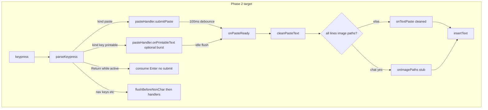
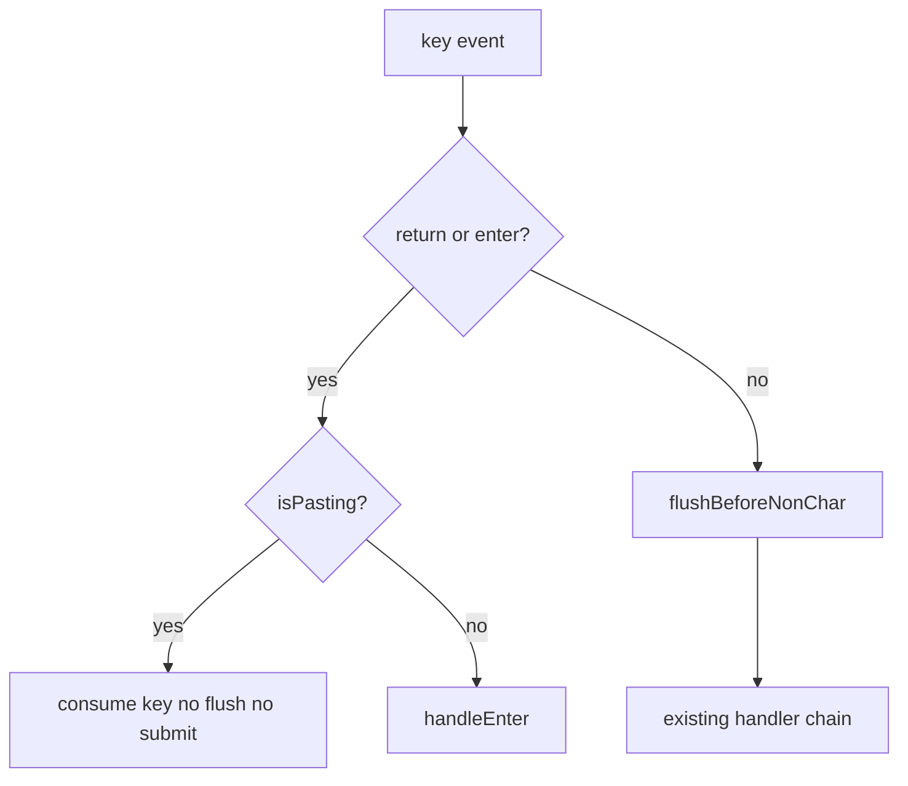

# Phase 2: Paste handler (text batching + safety)

## Philosophy (keep Phase 2 conservative)

Ship the high-confidence pieces first:

1. **Debounced** bracketed/parser paste (`submitPaste`) with cleaning.
2. **Enter guard** while paste is active (debounce + burst window).
3. **Burst handling** only as a narrow, well-tested supplement for split chunks — it is the part most likely to make ordinary fast typing feel subtly wrong.

Defer aggressive burst heuristics (Codex-style retro-capture, held-first-char flicker suppression) unless tests prove they are needed on a specific platform.

## Context

[Phase 1](docs/PLAN-copy-paste-phase-1.md) is implemented: [`bracketedPaste.ts`](src/ui/input/bracketedPaste.ts), [`parseKeypress.ts`](src/ui/input/parseKeypress.ts), [`constants.ts`](src/ui/input/constants.ts) (`PASTE_THRESHOLD = 800`), injectable `terminalControlStream`, and a thin inline path in [`chatPromptSession.ts`](src/ui/chatPromptSession.ts):

```1725:1728:src/ui/chatPromptSession.ts
  const handlePasteText = (text: string): void => {
    if (text.length > 0) {
      insertText(text);
    }
  };
```

Phase 2 replaces that inline path with [`pasteHandler.ts`](src/ui/input/pasteHandler.ts) per [docs/PLAN-copy-paste-full.md](docs/PLAN-copy-paste-full.md#phase-2--paste-handler-text-batching--safety).

**In scope:** debounced paste delivery, sanitization, `isPasting` + Enter guard, minimal path routing, narrowly scoped burst layer, tests.

**Out of scope (later phases):** image read/pills ([`imagePaste.ts`](src/ui/input/imagePaste.ts), Phase 4), `onEmptyPaste` / clipboard (Phase 5), agent `images` (Phase 6), placeholders / `expandSubmit` (Phase 3).

**Deferred from full-plan implementation order (step 1):** [`promptSubmission.ts`](src/ui/input/promptSubmission.ts) — see [PromptSubmission handoff](#promptsubmission-handoff) below.



## Phase 1 baseline (do not change parser contracts)

| Piece | Status |
|-------|--------|
| Bracketed paste enable/disable | Done |
| Parser emits `{ kind: "paste", text, isPasted: true }` | Done |
| `length > 800` → paste when unbracketed | Done in parser |
| Empty bracketed paste emitted | Done; Phase 2 still **no-ops** empty (no `onEmptyPaste`) |

`parseKeypress` stays unchanged; Phase 2 only consumes its output.

**Printable reality:** [`isPrintableKey`](src/ui/chatPromptSession.ts) accepts any non-empty `str` without Ctrl/Meta — not only single characters. [`parseKeypress`](src/ui/input/parseKeypress.ts) can emit short **multi-character** `{ kind: "key", str: "ab", … }` segments (see `appendTextSegment`). The burst API must accept `text.length >= 1`, not assume one code unit per call.

---

## PromptSubmission handoff

The [full plan](docs/PLAN-copy-paste-full.md) originally listed `PromptSubmission` + `isSubmissionEmpty` as **implementation-order step 1** (before paste work). **Phase 1–2 have intentionally diverged:** submission is still `{ text, inputMode }` through [`promptComposer.ts`](src/ui/promptComposer.ts) and [`index.ts`](src/index.ts).

| When | Action |
|------|--------|
| **Phase 2** | No `PromptSubmission` wiring; paste callbacks still call `insertText` / future pills only in the buffer. |
| **Before Phase 3** | Land `promptSubmission.ts` and thread `PromptSubmission` through submit → agent (images optional/no-op) so placeholder expansion and history policy attach to a stable type. |

Phase 3 should not discover surprise integration debt — treat submission typing as a **prerequisite commit** adjacent to Phase 3, not buried inside placeholder UI work.

---

## 1. New module: [`src/ui/input/pasteHandler.ts`](src/ui/input/pasteHandler.ts)

### Public API

```ts
export type PasteHandlerCallbacks = {
  onTextPaste: (text: string) => void;
  /** Chat mode only; Phase 4 will read files / add pills. Phase 2 may insert paths as text. */
  onImagePaths?: (paths: readonly string[]) => void;
};

export type PasteHandlerOptions = PasteHandlerCallbacks & {
  getInputMode: () => InputMode;
  debounceMs?: number; // default 100
  /** Inter-key gap for burst / split-chunk detection (default ~20ms; consider 30ms on win32 later). */
  burstCharIntervalMs?: number;
};

export type PasteHandler = {
  /** From parser paste events (always debounced). */
  submitPaste(text: string, meta: { isPasted: boolean }): void;
  /**
   * Rapid printable stream without bracketed paste (split chunks).
   * `text` may be multi-character (readline / parser); see onPrintableText behavior.
   */
  onPrintableText(text: string): "buffered" | "typed";
  /** Flush burst buffer before navigation/modifier keys — NOT before Return (see key ordering). */
  flushBeforeNonChar(): void;
  /** True during debounced paste and while burst buffer/window is active. */
  isPasting(): boolean;
  dispose(): void;
};

export function createPasteHandler(options: PasteHandlerOptions): PasteHandler;
export function cleanPasteText(text: string): string;
```

### `cleanPasteText` (exported for unit tests)

Apply in order on the merged paste body:

1. Strip ANSI (reuse same CSI pattern as [`chatPromptSession.ts` L82–111](src/ui/chatPromptSession.ts) — extract to `src/ui/input/cleanPasteText.ts` or duplicate once in pasteHandler to avoid coupling session → input).
2. **CRLF-safe line endings:** `text.replace(/\r\n?/g, "\n")` — do **not** use a bare `\r` → `\n` step (that turns Windows `\r\n` into `\n\n`).
3. `\t` → single space

Do **not** collapse placeholders or strip newlines beyond line-ending normalization (Phase 3).

### `submitPaste` and debounce (`onPasteReady`)

- **`text.length === 0`:** return immediately — no append, no timer, **`isPasting` stays false** (matches Phase 1 empty bracketed paste no-op; reserved for deferred clipboard `onEmptyPaste`).
- **Non-empty:** append to `pendingText`, set `isPasting = true`, reset `debounceMs` (100) timer.
- On timer fire: run `cleanPasteText`, classify, invoke callbacks once, clear `pendingText`, set `isPasting = false` after callbacks return.
- `dispose()` clears pending timers and sets a disposed flag so **no delayed callback** runs after `cleanup()`.

### Paste detection (when to treat input as paste)

Flush path runs when any of:

| Signal | Source |
|--------|--------|
| `meta.isPasted === true` | Bracketed paste or parser `> PASTE_THRESHOLD` heuristic |
| Merged `pendingText.length > PASTE_THRESHOLD` | Debounced multi-event paste |
| Burst buffer flush (split chunks) | See below — only when burst was active and idle timeout fired |

Path-shaped routing uses [`classifyDroppedText`](#routing-after-clean) — not as a generic “is this paste?” detector in Phase 2.

### Split chunks (`pastePendingRef`) — narrow scope

Terminals without bracketed paste may deliver paste as a rapid series of small `key` events (&lt; 800 chars each). Phase 2 adds a **minimal** burst layer (not full Codex retro-capture):

#### `onPrintableText(text)` contract

| `text.length` | Behavior |
|---------------|----------|
| `0` | No-op; return `"typed"` |
| `1` | Standard burst timing: buffer if inter-key ≤ `burstCharIntervalMs` or burst already active |
| `> 1` | Treat the whole segment as one burst unit (append atomically to `burstBuffer`); do not split into per-char decisions. Matches parser multi-char `str` and any readline batching. |

- Return `"buffered"` → caller must **not** `insertText`.
- On idle: if burst was active and (`burstBuffer.length > 1` OR total length &gt; `PASTE_THRESHOLD`), flush through `cleanPasteText` + routing as paste; else deliver buffer as normal typing via `onTextPaste`.
- **Skip burst entirely** when `searchState`, `typeaheadState`, or `historyIndex !== null` — pass through to `insertText` immediately (same guards as `insertText`).
- Parser-emitted `paste` events use `submitPaste` only — never `onPrintableText`.

**Conservative default:** keep `burstCharIntervalMs` tight; prefer false negatives (extra typed chars) over false positives (swallowing fast typing). Platform tuning (e.g. 30ms on Windows) is a follow-up only if tests reproduce split-paste failures.

**No retro-capture (Phase 2):** Without Codex-style “remove already-inserted prefix and merge into burst,” a rapid single-character stream may **only buffer from the second character onward** — the first char can appear in the buffer before burst is recognized. That is acceptable for Phase 2. **Tests should assert this actual behavior** (e.g. first char inserted or held per implementation, second+ merged on idle flush), not perfect reconstruction of every unbracketed paste shape. Bracketed/`submitPaste` paths remain the reliable full-paste story.

### Routing after clean {#routing-after-clean}

Phase 2 uses a **strict** rule so mixed path + prose is never split incorrectly:

```ts
const cleaned = cleanPasteText(merged);
const { paths, allNonEmptyLinesArePaths } = classifyDroppedText(cleaned);
const imagePaths = paths.filter(isImagePath);

const useImageBranch =
  getInputMode() === "prompt" &&
  onImagePaths &&
  imagePaths.length > 0 &&
  allNonEmptyLinesArePaths &&
  imagePaths.length === paths.length; // every parsed path is an image extension

if (useImageBranch) {
  onImagePaths(imagePaths);
} else {
  onTextPaste(cleaned); // preserves user text exactly — prose, mixed lines, bash, non-image paths
}
```

**Do not** call `onImagePaths` when any non-empty line is prose or a non-image path. **Do not** split one paste into `onImagePaths` + `onTextPaste` in Phase 2.

#### `classifyDroppedText` (minimal parser)

Export from [`parseDroppedPaths.ts`](src/ui/input/parseDroppedPaths.ts):

```ts
export type DroppedTextClassification = {
  paths: string[];
  allNonEmptyLinesArePaths: boolean;
};

export function classifyDroppedText(text: string): DroppedTextClassification;
export function isImagePath(path: string): boolean;
```

- Split on `\n`, trim lines, drop empties.
- Per line: `file://` decode via `URL` / pathname; **malformed URI → treat line as prose** (do not throw; line does not count toward `allNonEmptyLinesArePaths`). Bare absolute/relative paths (`/`, `./`, `../`, `~`, Windows `C:\` / `C:/`).
- `allNonEmptyLinesArePaths`: every non-empty line parsed as a path (not prose).
- **Defer** to Phase 4: quoted paths, backslash-escaped spaces, multi-path on one line, full Windows matrix.

Phase 2 **`onImagePaths` in session**: `insertText(paths.join("\n"))` until Phase 4 adds pills/read. Bash mode never calls `onImagePaths`.

---

## 2. Integration: [`chatPromptSession.ts`](src/ui/chatPromptSession.ts)

### Create handler at session start

```ts
const pasteHandler = createPasteHandler({
  getInputMode: () => inputMode,
  onTextPaste: (text) => { if (text.length > 0) insertText(text); },
  onImagePaths: (paths) => { insertText(paths.join("\n")); }, // Phase 4 replaces
});
```

### Key ordering (Enter vs flush) — explicit

**Problem:** If Return runs `flushBeforeNonChar()` synchronously and then `handleEnter()`, the flushed paste is already in the buffer and Enter **submits** it — defeating the guard.

**Rule for each queued `key` event** (after paste events are handled):



1. **`return` / `enter`:** If `pasteHandler.isPasting()` → **return true immediately** (consume Enter). Do **not** call `flushBeforeNonChar()` first. Optionally insert `\n` into burst buffer later if multiline burst is needed — Phase 2 may no-op Enter during burst.
2. **All other keys** (arrows, Escape, Ctrl combos, etc.): call `pasteHandler.flushBeforeNonChar()` at the start of `handleControlAndSystemKeys` (before `handleNewlineAndEnterKeys` runs for other keys), then run the existing chain.
3. **Printable keys:** If burst not skipped, `onPrintableText(text)`; if `"buffered"`, skip `insertText`; else `insertText(text)`.

[`handleNewlineAndEnterKeys`](src/ui/chatPromptSession.ts) (L1586) should check `isPasting()` **before** calling `handleEnter()` (L1594–1596).

### `shouldSkipBurst` (session-local helper)

Not part of `PasteHandler` — define inside `createChatPromptSession` next to burst wiring:

```ts
const shouldSkipBurst = (): boolean =>
  Boolean(searchState || typeaheadState || historyIndex !== null);
```

When `shouldSkipBurst()` is true, printables go straight to `insertText` (no `onPrintableText`).

### `handleKeypress` routing (summary)

```ts
if (parsed.kind === "paste") {
  pasteHandler.submitPaste(parsed.text, { isPasted: parsed.isPasted });
  continue;
}

const { str: keyStr, key: keyObj } = parsed;

// Enter: consume while paste active (see ordering above)
if (keyObj.name === "return" || keyObj.name === "enter") {
  if (pasteHandler.isPasting()) continue;
}

if (handleControlAndSystemKeys(keyStr, keyObj)) continue; // flushBeforeNonChar at start of this path
// ... search, typeahead, navigation ...

if (isPrintableKey(keyStr, keyObj)) {
  const text = keyStr ?? "";
  if (!shouldSkipBurst() && pasteHandler.onPrintableText(text) === "buffered") continue;
  insertText(text);
}
```

### Lifecycle

- `cleanup()`: `pasteHandler.dispose()` (clear timers, ignore late flushes) before `disableBracketedPaste`.

Remove `handlePasteText`.

---

## 3. Testing

| File | Cases |
|------|--------|
| **`pasteHandler.test.ts`** | `cleanPasteText`: ANSI; **CRLF** (`a\r\nb` → `a\nb`, not `a\n\nb`); lone `\r`; tabs; **`submitPaste("")` does not set `isPasting` or schedule debounce**; debounce merges two non-empty `submitPaste`; `isPasting` during debounce; **`dispose()`** — no callback after dispose + timer advance; path-only → `onImagePaths` in prompt; bash → `onTextPaste` only; **mixed image path + prose** → single `onTextPaste(cleaned)`; burst: rapid `onPrintableText` **after burst activates** flushes buffered suffix as one paste/typed unit per contract (not full retro-capture); **multi-char** `onPrintableText("ab")` buffered atomically; `flushBeforeNonChar` before navigation |
| **`parseDroppedPaths.test.ts`** | `classifyDroppedText`: `file://`, bare paths, two lines; prose → `allNonEmptyLinesArePaths: false`; **malformed `file://`** → line treated as prose (no throw) |
| **`chatPromptSession.test.ts`** | Bracketed paste inserts full text (fake timers for debounce); Enter during debounced paste **does not submit**; **Enter during active burst (before idle flush) does not submit**; after burst idle flush and `isPasting() === false`, Enter **may submit** normally; **burst disabled** during search / typeahead / history navigation |
| **`promptComposer.test.ts`** | Regression: cleanup + dispose clears timers |

Use `vi.useFakeTimers()`; advance `debounceMs + 1ms` for flush assertions.

**Multi-char printables and session tests:** If `onPrintableText("ab")` (or any multi-char `str` from [`parseKeypress`](src/ui/input/parseKeypress.ts)) is buffered and later flushed as paste, existing short multi-char keypress tests in [`chatPromptSession.test.ts`](src/ui/__tests__/chatPromptSession.test.ts) (e.g. `"!pwd"` bash mode) may **not** see synchronous buffer updates until debounce/burst idle. Expect to use **fake timers**, advance past `debounceMs`, or pass a **test-only `debounceMs: 0`** (or injectable clock) on `createPasteHandler` when updating those tests. Parser unit tests stay unchanged; integration tests own timer wiring.

Existing Phase 1 **parser** tests stay green without changes.

---

## 4. Dependencies and handoff

| Phase 2 delivers | Later phase consumes |
|------------------|----------------------|
| Debounced, cleaned paste → `insertText` | Phase 3: collapse large text to `[Pasted text #N]`; requires `PromptSubmission` first |
| `onImagePaths` + `classifyDroppedText` | Phase 4: read files, pills, expand parser |
| `isPasting` / Enter consume | Phase 5: empty clipboard paste |
| `getInputMode()` routing | Unchanged bash vs chat |

---

## 5. Validation

- `npm test`, `npm run build`, `npm run format:check` if many files touched
- `npx fallow audit` can wait until more paste stack lands ([AGENTS.md](AGENTS.md))

---

## 6. Risks

| Risk | Mitigation |
|------|------------|
| Debounce breaks bracketed-paste session test | Fake timers or test-only `flush()` |
| Burst misclassifies fast typing | Skip burst in search/typeahead/history; conservative interval; narrow tests |
| Unbracketed paste missing first char | Documented limitation; no retro-capture in Phase 2; bracketed/`submitPaste` for full fidelity |
| Session tests hang or flake on `!pwd`-style input | Fake timers or test `debounceMs` override after multi-char burst wiring |
| Enter flushes then submits | **Explicit ordering:** consume Enter while `isPasting()`, never flush-then-enter |
| CRLF double newlines | `/\r\n?/g` only |
| Mixed path/prose split wrong | Strict `allNonEmptyLinesArePaths` + image-only branch |
| `PromptSubmission` debt | Document handoff; land before Phase 3 |
| Timer after cleanup | `dispose()` guard flag |
| Windows slow inter-key paste | Tune `burstCharIntervalMs` only if needed |

---

## File checklist

- **Create:** `pasteHandler.ts`, `parseDroppedPaths.ts` (`classifyDroppedText`, `isImagePath`)
- **Create:** `__tests__/pasteHandler.test.ts`, `__tests__/parseDroppedPaths.test.ts`
- **Edit:** `chatPromptSession.ts` — handler, Enter ordering, printable burst, cleanup
- **Edit:** `PLAN-copy-paste-full.md` — Phase 2 cleaning line + PromptSubmission note (done in same PR as this doc)
- **Optional:** extract shared ANSI strip for `cleanPasteText`
