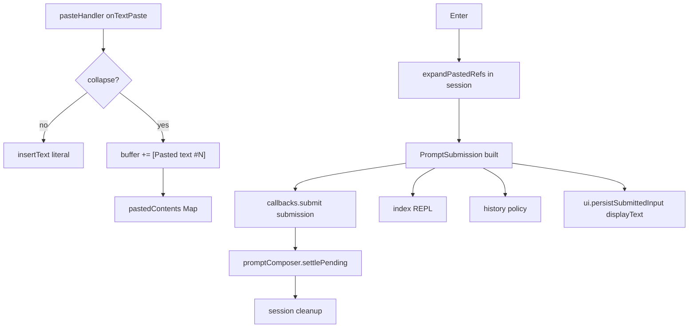

# Phase 3: Large text placeholders + submit expansion

Parent overview: [PLAN-copy-paste-full.md](PLAN-copy-paste-full.md#phase-3--large-text-placeholders--submit-expansion).

## Current baseline

Phase 1–2 are in place: [`bracketedPaste.ts`](../src/ui/input/bracketedPaste.ts), [`parseKeypress.ts`](../src/ui/input/parseKeypress.ts), [`pasteHandler.ts`](../src/ui/input/pasteHandler.ts), [`parseDroppedPaths.ts`](../src/ui/input/parseDroppedPaths.ts), and session wiring in [`chatPromptSession.ts`](../src/ui/chatPromptSession.ts) (paste → `insertText` / path strings).

Still **not** landed (called out in [PLAN-copy-paste-phase-2.md](PLAN-copy-paste-phase-2.md#promptsubmission-handoff)):

- No [`promptSubmission.ts`](../src/ui/input/promptSubmission.ts)
- [`PromptResultSubmitted`](../src/ui/promptComposer.ts) is `{ text, inputMode }` only
- [`handleInteractiveSubmission`](../src/index.ts) bails on `!trimmedInput` (would drop image-only later)
- [`Agent.streamChat`](../src/agent.ts) takes `userMessage: string` only; `beginUserTurn` is string-only

Phase 3 must not bury submission typing inside placeholder UI work—ship it as the first commit (or tightly coupled first PR slice).



**P1 — Expand before cleanup:** [`settlePending`](../src/ui/promptComposer.ts) calls `activeChatSession.cleanup()` **before** `persistSubmittedPrompt` / `resolve` (L246–258). If expansion runs only inside `settlePending` after cleanup, and cleanup clears `pastedContents`, the agent gets pills with no registry body.

**Required ordering (pick one; prefer A):**

| Option | Where | Composer receives |
|--------|--------|-------------------|
| **A (preferred)** | `handleEnter` in session: snapshot buffer + `new Map(pastedContents)` → `expandPastedRefs` → `callbacks.submit(submission)` | `PromptSubmission` already built |
| B | Session passes `displayText`, `inputMode`, and **`new Map(pastedContents)`** (copy) into submit; composer expands **before** `cleanup()` | Raw map + display text |
| C | `settlePending` reorders: expand (or accept pre-built submission) **then** `cleanup()` | Either |

Do **not** rely on reading `pastedContents` after `cleanup()`. Option A keeps expansion next to the registry owner and makes `settlePending` a thin resolve + history persist.

**P1 — Agent text vs transcript vs history:** Three consumers, three rules:

| Consumer | Field | Rule |
|----------|--------|------|
| Agent / `streamChat` | `submission.text` | Expanded body (placeholders → full paste / image markers) |
| Slash command handlers | `submission.text.trim()` | Expanded then trimmed — see [slash adapter](#slash-commands-and-bash-adapter) below |
| Live UI transcript | `submission.displayText` | Buffer snapshot **with pills** — [`handleChatSubmission`](../src/index.ts) must call `ui.persistSubmittedInput(submission.displayText)`, **not** expanded text, so huge pastes do not flood the visible conversation |
| Prompt history (`historyStore` / readline live history) | Expanded `submission.text` | Only when length ≤ `HISTORY_INLINE_MAX`; never `displayText` |

`displayText` is never written to `prompt-history.json`. Transcript may show `[Pasted text #1 +42 lines]`; the model still receives full content via `text`.

---

## Part 0 — Prerequisite: `PromptSubmission` plumbing

**New:** [`promptSubmission.ts`](../src/ui/input/promptSubmission.ts)

```ts
export type PromptImage = Uint8Array | string;
export interface PromptSubmission {
  text: string;           // expanded for agent
  displayText: string;    // buffer snapshot with pills
  inputMode: InputMode;
  images?: PromptImage[];
}
export function isSubmissionEmpty(s: PromptSubmission): boolean;
export const HISTORY_INLINE_MAX = 1024;
```

**Wire (minimal; images unused until Phase 4/6):**

| File | Change |
|------|--------|
| [`promptComposer.ts`](../src/ui/promptComposer.ts) | `PromptResultSubmitted` → `submission: PromptSubmission` only (remove top-level `text`); `settlePending` is submission-only (chat pre-built in session; non-TTY wrapped in `rl.question` callback); `persistSubmittedPrompt(submission)` records history (bash via `formatBashHistoryEntry(submission.text.trim())`); `confirm()` reads `result.submission.displayText` |
| [`chatPromptSession.ts`](../src/ui/chatPromptSession.ts) | `submit(submission: PromptSubmission)` from `handleEnter` after in-session `expandPastedRefs` |
| [`index.ts`](../src/index.ts) | `isSubmissionEmpty(submission)`; [slash adapter](#slash-commands-and-bash-adapter); chat: `persistSubmittedInput(submission.displayText)`; pass `PromptSubmission` through turn pipeline (checklist below) |
| [`agent.ts`](../src/agent.ts) | `streamChat(submission: PromptSubmission, …)`; unwrap `submission.text` internally until Phase 6 images |
| [`assistantTurnRenderer.ts`](../src/ui/assistantTurnRenderer.ts) | `streamAssistantTurn(agent, submission, …)` → `agent.streamChat(submission, …)` |

Non-TTY `rl.question` path: the `rl.question` callback wraps `answer` in a trivial `PromptSubmission` (`text` and `displayText` both `answer`, no registry) and calls `settlePending({ status: "submitted", submission })` — same submission-only shape as chat; `settlePending` does not construct submissions itself.

### Submission-object migration checklist (P2)

Route `PromptSubmission` through these **string-only waypoints** in Part 0 (agent may still use `submission.text` only until Phase 6):

| Location | Today | Target |
|----------|--------|--------|
| [`runInteractiveTurn`](../src/index.ts) L316 | `input: string` | `submission: PromptSubmission` |
| [`handleChatSubmission`](../src/index.ts) L584 | `trimmedInput` string | full `submission`; transcript = `displayText` |
| [`handleInteractiveSubmission`](../src/index.ts) L594 | `trimmedInput: string` | `submission`; derive `trimmedText` for slash chain — see adapter |
| [`streamAssistantTurn`](../src/ui/assistantTurnRenderer.ts) L36 | `userInput: string` | `submission: PromptSubmission` |
| `streamAssistantTurn` → [`agent.streamChat`](../src/ui/assistantTurnRenderer.ts) L345 | `userInput` | `submission` |
| Non-interactive stdin path [`index.ts`](../src/index.ts) L256 | string | `PromptSubmission` with `displayText === text` |
| [`promptComposer.confirm`](../src/ui/promptComposer.ts) L359 | `result.text` | `result.submission.displayText` (confirm mode has no pills) |
| REPL loop [`index.ts`](../src/index.ts) L721+ | `nextInput.text` | `nextInput.submission` |
| Bash branch | trimmed string | REPL runs `processBashCommand(submission.text.trim(), …)` only; **do not** record bash history in the REPL |

### Slash commands and bash (adapter)

Keep slash handlers string-based; they do not need `images` or `displayText`:

```ts
// handleInteractiveSubmission (after isSubmissionEmpty)
const trimmedText = submission.text.trim();

for (const handler of handlers) {
  const result = await handler(trimmedText, context); // slash handlers unchanged signature
  ...
}

// handleChatSubmission — full submission
async function handleChatSubmission(
  submission: PromptSubmission,
  context: InteractiveSubmissionContext,
) {
  context.ui.persistSubmittedInput(submission.displayText);
  return await runInteractiveTurn(submission, context, { ... });
}
```

**Bash mode — split ownership (avoid double history):**

| Layer | Responsibility |
|-------|----------------|
| [`persistSubmittedPrompt`](../src/ui/promptComposer.ts) | **Only** place that records bash/chat prompt history (today and after Phase 3). For bash: `formatBashHistoryEntry(submission.text.trim())` when history policy allows — same as current `inputMode === "bash"` branch. |
| REPL bash branch [`index.ts`](../src/index.ts) L725+ | **Execute only:** `processBashCommand(submission.text.trim(), …)`. Do not call `historyStore.record` or `formatBashHistoryEntry` here. |

Transcript/display for bash can use `displayText` if needed (usually equals the buffer; pills are chat-only).

**Tests:** `isSubmissionEmpty`; composer/session submit ordering (expand before cleanup); update [`promptComposer.test.ts`](../src/ui/__tests__/promptComposer.test.ts), [`assistantTurnRenderer.test.ts`](../src/ui/__tests__/assistantTurnRenderer.test.ts), interactive tests as needed.

---

## Part 1 — Registry + collapse on paste

**New types** (shared module, e.g. [`pastedContent.ts`](../src/ui/input/pastedContent.ts) or colocated with expand):

```ts
export type PastedContent =
  | { id: number; type: "text"; content: string }
  | { id: number; type: "image"; data: PromptImage; mediaType: string; filename: string; path?: string };
```

**Session state** in `createChatPromptSession`:

- `pastedContents: Map<number, PastedContent>`
- `nextPasteId` (monotonic)
- Reset map on session `cleanup()` **after** submit (next prompt starts empty); safe because expansion runs in `handleEnter` before `submit` / cleanup

**Collapse helper** (e.g. [`collapsePaste.ts`](../src/ui/input/collapsePaste.ts)):

| Input | Rule |
|-------|------|
| Char threshold | `cleaned.length > PASTE_THRESHOLD` ([`constants.ts`](../src/ui/input/constants.ts), 800) |
| Line threshold | `countPasteLines(cleaned) > maxLines` where `maxLines = Math.max(1, Math.min((outputStream.rows ?? 24) - 10, 2))` — uses **prompt** [`outputStream`](../src/ui/chatPromptSession.ts), not `terminalControlStream` |
| Under threshold | Return `null` → caller `insertText(cleaned)` |

**`countPasteLines` (P3 — precise, testable):**

- Split on `\n`.
- If the string is non-empty and ends with `\n`, drop the final empty segment (trailing newline only — do not drop intentional blank lines in the middle).
- `lineCount` = length of the resulting array (every segment counts, including `""` blank lines between newlines).
- Examples: `"a\nb"` → 2; `"a\nb\n"` → 2; `"a\n\nb"` → 3; `""` → 0; `"\n"` → 1.

On collapse (text only in Phase 3):

1. Allocate `id`, store `{ type: "text", content: cleaned }`
2. Insert pill at cursor: `[Pasted text #N]` when `lineCount <= 1`, else `[Pasted text #N +M lines]` with **`M = lineCount - 1`**
3. `insertText(pill)` (single atomic insert)

**`onTextPaste` in session** replaces direct `insertText(text)` with collapse-or-insert.

**Unchanged in Phase 3:** [`onImagePaths`](../src/ui/chatPromptSession.ts) still `insertText(paths.join("\n"))` until Phase 4.

**Pill rendering:** MVP is **literal tokens** in the buffer (no fuzzy repair). Optional follow-up: detect token pattern in `buildPromptLayout` and wrap with [`formatSubtle`](../src/ui/formatting.ts)—not required for Phase 3 acceptance.

---

## Part 2 — Expand at submit + history

**New:** [`expandSubmit.ts`](../src/ui/input/expandSubmit.ts)

```ts
export function expandPastedRefs(
  displayText: string,
  pastedContents: ReadonlyMap<number, PastedContent>,
  inputMode: InputMode,
): PromptSubmission;
```

**Token grammar (P3 — separate patterns):**

| Kind | Pattern | Notes |
|------|---------|--------|
| Text pill | `\[(?:Pasted text) #(\d+)(?: \+(\d+) lines)?\]` | Optional `+M lines` suffix **text only** |
| Image pill | `\[Image #(\d+)\]` | **No** `+M lines` variant — do not match `[Image #1 +2 lines]` |

Scan left-to-right; on each match, parse id (and optional `M` on text tokens — **ignore `M` for expansion**, it is display-only; registry `content` is authoritative).

**Duplicate and manual token semantics (P2):**

| Case | Behavior |
|------|----------|
| Exact canonical token, id **in** registry | Expand **every** occurrence independently (same id → same body repeated). **No** consume-once. |
| Token shape matches but id **not** in registry | Leave literal (includes manual typing of `[Pasted text #99]` with no entry) |
| User-edited / partial token (spacing, broken `#`, split pill) | No regex match → literal |
| Duplicate pill in buffer (two `[Pasted text #1]` copies) | Both expand to registry #1 content |

This matches the full plan: registry + exact token scan, no fuzzy repair; “duplicate” in the full plan means **edited** duplicates that no longer match, not single-use expansion.

**Expansion output:**

- **Text pills:** substitute full `content`
- **Image pills:** `[Attached image: <basename>]` in `text`; append `data` to `images[]` in **left-to-right token order** (not numeric id sort)—implement now even though session only creates text entries until Phase 4

**Where expansion runs (see P1 ordering):**

```ts
// chatPromptSession handleEnter (preferred)
const submission = expandPastedRefs(buffer, pastedContents, inputMode);
callbacks.submit(submission);
```

```ts
// promptComposer.settlePending — submission already built; then cleanup
if (result.status === "submitted") {
  persistSubmittedPrompt(result.submission);
}
if (activeChatSession) {
  activeChatSession.cleanup();
  ...
}
```

**History policy** ([full plan](PLAN-copy-paste-full.md#history-policy-mvp)):

| Condition | `historyStore.record` |
|-----------|------------------------|
| Expanded `submission.text.length <= HISTORY_INLINE_MAX` | Record expanded `text` (existing slash guards via `shouldRecordPromptHistoryEntry`) |
| Expanded length > 1024 | **Skip** |
| Image-only (`text` trim empty, `images?.length`) | **Skip** (MVP) |

Never record `displayText` with pills. Extend `shouldKeepLiveHistoryEntry` / `persistSubmittedPrompt` accordingly.

---

## Part 3 — Tests and validation

| File | Cases |
|------|--------|
| **`expandSubmit.test.ts`** (new) | Inline `fix [Pasted text #1] please`; **two identical `[Pasted text #1]`** both expand; unknown id literal; **`[Image #1 +2 lines]` does not match** image pattern; image token order `[Image #2] … [Image #1]` → `images` order; manual token without registry |
| **`collapsePaste.test.ts`** (new) | Under/over 800 chars; line cap with mocked `rows`; **`countPasteLines`** cases (`a\nb\n`, `a\n\nb`, trailing newline); pill `+M` with `M = lineCount - 1` |
| **Integration** | Submit builds submission before session cleanup; transcript receives `displayText`, agent path receives expanded `text` |
| **`promptSubmission.test.ts`** (new) | `isSubmissionEmpty` text-only vs image-only vs both empty |
| **`chatPromptSession.test.ts`** | Large paste inserts pill not full body; submit expands in composer integration (fake timers for debounce if needed) |
| **`promptComposer.test.ts`** | Submitted result includes `submission` only (no top-level `text`); history skip when expanded > 1024; **non-TTY `rl.question`:** callback builds `{ submission: { text: answer, displayText: answer, inputMode } }` before `settlePending` |

Run: `npm test`, `npm run build`, `npm run format:check`. `npx fallow audit` after the stack lands ([AGENTS.md](../AGENTS.md)).

---

## Explicitly out of scope (Phase 4+)

- [`imagePaste.ts`](../src/ui/input/imagePaste.ts), reading files, `[Image #N]` pills in session
- Slash + images rejection ([full plan](PLAN-copy-paste-full.md#bash-mode-and-slash-commands)) — when `images` can be non-empty
- `beginUserTurn(..., images)` / provider multimodal ([Phase 6](PLAN-copy-paste-full.md#phase-6--agent--context-multimodal-wiring))
- Paste-cache / clipboard ([Phase 5](PLAN-copy-paste-full.md#phase-5-deferred--clipboard-image--paste-cache-history))
- Quoted-path expansion in [`parseDroppedPaths.ts`](../src/ui/input/parseDroppedPaths.ts) (Phase 4)

---

## Suggested commit order

1. **`promptSubmission` + full migration checklist** (no collapse yet; `displayText === text`; transcript/agent paths typed)
2. **Registry + `countPasteLines` / `collapsePaste` + session `onTextPaste`**
3. **`expandPastedRefs` in session `handleEnter` + history policy + submit-before-cleanup tests**

## Risks (from review)

| Risk | Mitigation |
|------|------------|
| Cleanup clears registry before expand | Expand in session before `submit`; or copy Map + expand before `cleanup()` |
| Huge paste in transcript | `persistSubmittedInput(displayText)` only |
| Missed string waypoints | Part 0 checklist + compiler errors on `PromptResultSubmitted` |
| Ambiguous duplicate expansion | Document: repeat expand per match, no consume-once |
| `[Image #N +M lines]` false positive | Separate regex; no line suffix on image tokens |
| `split("\n")` trailing newline | Shared `countPasteLines` helper + unit tests |
