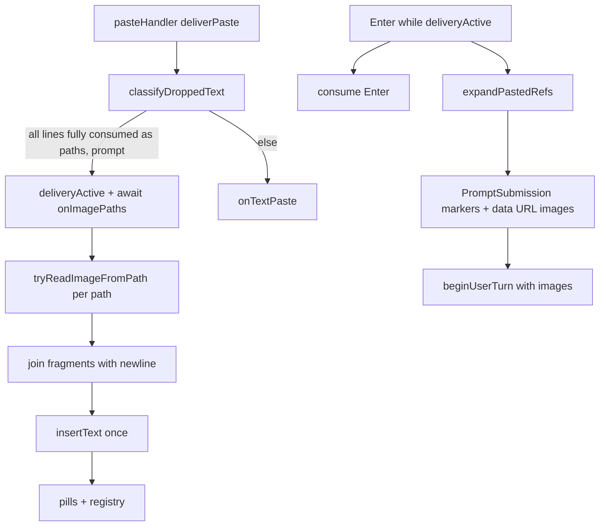

# Phase 4: Image paths (drag-and-drop = paste paths)

Parent overview: [PLAN-copy-paste-full.md](PLAN-copy-paste-full.md#phase-4--image-paths-drag-and-drop--paste-paths).

## Pre-implementation decisions (resolve before coding)

These are contract choices, not architecture debates. Lock them in the first commit that touches the relevant module.

| Decision | Choice | Rationale |
|----------|--------|-----------|
| **Async paste / Enter guard** | Add `deliveryActive` in [`pasteHandler.ts`](../src/ui/input/pasteHandler.ts); `isPasting() === debounceActive \|\| burstActive \|\| deliveryActive`. Widen `onImagePaths` to return `void \| Promise<void>`; **`await` it inside `runDelivery`** before clearing `deliveryActive`. **`debounceActive` may clear when the debounce window ends** (before async I/O); **`deliveryActive = true` is set synchronously at the top of `runDelivery`**, before the first `await`, so there is no gap where `isPasting()` is false during image delivery. | Today `flushDebounce` sets `debounceActive = false` then calls sync `deliverPaste` ([`pasteHandler.ts`](../src/ui/input/pasteHandler.ts) L86–89), so `isPasting()` is already false when image I/O would run. Enter could submit an empty/partial buffer without an explicit delivery phase. |
| **`.bmp` handling** | **Route** `.bmp` via `isImagePath` → `onImagePaths` → `tryReadImageFromPath` → reject with `unsupported_type` + transient user message. | Rejecting only at read time while excluding BMP from `isImagePath` would paste `.bmp` literally and never show “convert to PNG/JPEG”. Routing + read-time reject matches user expectation for “I dropped an image.” |
| **Image bytes in `PromptImage`** | Always store **`data:image/<mime>;base64,...` data URLs** in registry `data` and `submission.images`. | Gemini defaults raw base64 strings to PNG ([`gemini.ts`](../src/providers/gemini.ts) ~L157); Bedrock **ignores** non–data-URL strings ([`bedrock.ts`](../src/providers/bedrock.ts) L357–359). Data URLs preserve MIME without changing `ChatMessage.images` shape. |
| **Image-only submit text** | **Preferred (already in Phase 3 tests):** expand lone `[Image #N]` to `[Attached image: <basename>]`; `isImageOnlySubmission` strips markers → empty trim → image-only. Do **not** switch to empty `text` for image-only in Phase 4. | [`expandSubmit.test.ts`](../src/ui/input/__tests__/expandSubmit.test.ts) L102–111; [`isImageOnlySubmission`](../src/ui/input/promptSubmission.ts) uses marker stripping. Phase 4 integration tests must assert this end-to-end. |
| **Multi-path insert separator** | When building buffer text for a batch paste, join each per-path fragment with **`"\n"`** (including literal fallbacks and pills). Single `insertText(batch)` after all reads finish. | Avoids `/bad.png[Image #1]` from sequential `insertText` without separators. |
| **`onImagePaths` errors** | Catch in `pasteHandler.runDelivery` → fallback **`onTextPaste(cleaned)`**; outer `.catch` only as safety net. | Prevents unhandled rejections from fire-and-forget async delivery. |
| **Dispose / late delivery** | `pasteHandler.dispose()` bumps **`deliveryGeneration`**; session **`onImagePaths`** checks a delivery token before `insertText`. | Avoids mutating buffer after prompt `cleanup()`. |
| **User-facing read errors** | Set **`editorStatus`** (existing status line), not a nonexistent `setTransientStatus`. | Matches [`chatPromptSession.ts`](../src/ui/chatPromptSession.ts) render model. |

---

## Current baseline

Phases 1–3 are landed (or in final integration on this branch):

| Piece | Status |
|-------|--------|
| Bracketed paste, parser, paste handler, Enter guard | Done |
| [`promptSubmission.ts`](../src/ui/input/promptSubmission.ts), `PromptSubmission` through composer / `index.ts` / `streamChat` | Done |
| Text collapse + `[Pasted text #N]` pills, `expandPastedRefs` | Done |
| [`parseDroppedPaths.ts`](../src/ui/input/parseDroppedPaths.ts) — bare paths, `file://`, Windows drives | **Partial** (no quotes / multi-path-per-line / escaped spaces / per-line consumed check) |
| Paste handler image branch → `onImagePaths` | Done (routing only; **sync**, no `deliveryActive`) |
| Session `onImagePaths` | **Stub:** `insertText(paths.join("\n"))` — no read, no pills |
| [`expandSubmit.ts`](../src/ui/input/expandSubmit.ts) image token expansion | Done (awaits registry `type: "image"` entries) |
| [`imagePaste.ts`](../src/ui/input/imagePaste.ts) | **Missing** |
| Slash + images guard | **Missing** in [`handleInteractiveSubmission`](../src/index.ts) |
| `Agent.streamChat` → `beginUserTurn` with `images` | **Missing** — uses `submission.text` only ([`agent.ts`](../src/agent.ts) L2150–2151) |



**Phase 4 goal:** path-only image drops → chat `[Image #N]` pills; data-URL attachments; hardened path parsing; async-safe paste delivery; bash vs chat and slash rules.

---

## Part 0 — Scope boundaries

| In Phase 4 | Deferred |
|------------|----------|
| Read image files from disk (no `sharp`) | macOS clipboard image (`clipboardImage.ts`, Phase 5) |
| `[Image #N]` pills + registry in **chat** | Paste-cache history (Phase 5) |
| Robust `parseDroppedPaths` + `deliveryActive` paste contract | BMP **conversion** (reject only; optional `sharp` later) |
| Slash reject when `images.length > 0` | Transcript “(N images attached)” polish (Phase 6) |
| `beginUserTurn(text, images?)` with data URLs | `ChatMessage.images` schema change / per-provider resize |

Phase 6 remains documentation and provider-edge polish; Phase 4 must attach data-URL `images` on the user turn so pasted JPEGs are not mislabeled as PNG.

---

## Part 1 — Harden `parseDroppedPaths`

**Module:** [`parseDroppedPaths.ts`](../src/ui/input/parseDroppedPaths.ts)

| Case | Target behavior |
|------|-----------------|
| Quoted paths | `'/path/with spaces.png'`, `"C:\\path with spaces\\a.jpg"` → strip quotes |
| `file://` | `fileURLToPath`; `%20` etc. decoded |
| Trailing `\r` | Strip per line (macOS drag) |
| Multiple paths on one line | Tokenize; whitespace only outside quotes |
| Backslash-escaped spaces | Unescape where terminals emit `\ ` |
| Trailing prose on a line | Must **fail** line consumption (e.g. `/tmp/a.png notes`) |

### Per-line API (required)

`string[]` alone cannot prove “no leftover prose.” Use an explicit consumption result:

```ts
export type DroppedPathsLineResult =
  | { ok: true; paths: string[] }
  | { ok: false; paths: string[] }; // partial paths allowed for debugging; classify must treat as not-all-paths

/** Parse one line (0..N paths). ok === true iff the entire line (after trim) is consumed as paths only. */
export function parseDroppedPathsLine(line: string): DroppedPathsLineResult;

/** Aggregate: split on \n, parse each non-empty line; allNonEmptyLinesArePaths iff every line ok. */
export function classifyDroppedText(text: string): DroppedTextClassification;
```

**`classifyDroppedText` rules:**

- For each non-empty line: `parseDroppedPathsLine(line)` must return `{ ok: true, paths: [...] }` with `paths.length >= 1`.
- Any `{ ok: false }` or empty path list on a line → `allNonEmptyLinesArePaths = false`.
- Flatten all `paths` from successful lines into `DroppedTextClassification.paths`.

**`isImagePath`:** include `.bmp` so BMP drops route to `onImagePaths` and fail in `imagePaste.ts` with a clear message (see [Pre-implementation decisions](#pre-implementation-decisions-resolve-before-coding)).

**Path normalization (before read):** expand `~/` and `~` using `os.homedir()` in **`normalizeDroppedPath(path)`** (called from `tryReadImageFromPath`, or shared from parser output). Test: `~/Pictures/a.png` reads correctly. Parser may still *classify* `~/foo.png` as a path line; expansion happens before `fs`.

**Tests:** [`parseDroppedPaths.test.ts`](../src/ui/input/__tests__/parseDroppedPaths.test.ts)

- `parseDroppedPathsLine("/tmp/a.png notes")` → `{ ok: false, ... }`
- Quoted spaces; two paths one line; `file:///tmp/a%20b.png`
- `classifyDroppedText` with one bad line → `allNonEmptyLinesArePaths: false`
- Windows quoted `C:\` paths; trailing `\r`
- `normalizeDroppedPath("~/x.png")` → absolute under home

---

## Part 2 — `imagePaste.ts` (read + validate)

**New:** [`imagePaste.ts`](../src/ui/input/imagePaste.ts)

```ts
export const MAX_IMAGE_BYTES = 8 * 1024 * 1024; // 8 MiB — document in README

export type ImageReadFailureReason =
  | "missing"           // ENOENT
  | "not_file"          // directory, or path not a regular file
  | "read_error"        // EACCES, EISDIR, I/O error, etc.
  | "too_large"
  | "unsupported_type"  // .bmp, unknown extension
  | "invalid_bytes";    // magic mismatch

export type ImageReadResult =
  | {
      ok: true;
      /** Always data:image/<mime>;base64,... for provider compatibility. */
      data: string;
      mediaType: string;
      filename: string;
      path: string; // normalized absolute path
    }
  | { ok: false; reason: ImageReadFailureReason };

export function buildImagePastePill(id: number): string;

export function normalizeDroppedPath(path: string): string;

export async function tryReadImageFromPath(
  filePath: string,
): Promise<ImageReadResult>;
```

**Read pipeline:**

1. `normalizeDroppedPath` (incl. `~/` → home).
2. `stat` — not found → `missing`; not `isFile()` → `not_file`.
3. Size > `MAX_IMAGE_BYTES` → `too_large`.
4. Extension: png/jpg/jpeg/gif/webp/**bmp**; `.bmp` → `unsupported_type` (user message via session status — see Part 3b).
5. Magic-byte sniff → `invalid_bytes` on mismatch.
6. Build `data:${mediaType};base64,${payload}`; set `mediaType` from extension/sniff (`image/png`, `image/jpeg`, etc.).

**No `sharp`**, no optional dependency in `package.json`.

**User-visible errors (chat):** literal path fallback still inserted for that path. Surface messages via the session’s existing **`editorStatus`** / status-line render path ([`chatPromptSession.ts`](../src/ui/chatPromptSession.ts) — `editorStatus` is set e.g. after external editor cancel messages); add a small `setImagePasteStatus(message)` helper if that keeps call sites tidy. Do **not** assume a `setTransientStatus` API exists.

**Tests:** [`imagePaste.test.ts`](../src/ui/input/__tests__/imagePaste.test.ts)

- Small PNG → data URL prefix `data:image/png;base64,`
- JPEG → `image/jpeg` in URL
- Over limit; `.bmp` → `unsupported_type`
- Wrong magic; `missing`; directory → `not_file` (deterministic)
- `read_error`: optional / platform-conditional (permission-denied fixtures are flaky across CI OS users); prefer unit-testing the reason mapping with a mocked `fs` failure
- `~/…` expansion (mock homedir or temp home)

---

## Part 3 — Paste handler async contract + session wiring

### 3a — `pasteHandler` delivery phase

**Changes in [`pasteHandler.ts`](../src/ui/input/pasteHandler.ts):**

```ts
export type PasteHandlerCallbacks = {
  onTextPaste: (text: string) => void;
  onImagePaths?: (paths: readonly string[]) => void | Promise<void>;
};

let deliveryActive = false;
let deliveryGeneration = 0; // bumped on dispose()

async function runDelivery(merged: string, generation: number): Promise<void> {
  if (disposed || generation !== deliveryGeneration) {
    return;
  }

  const cleaned = cleanPasteText(merged);
    // ... classify → useImageBranch, imagePaths ...

  deliveryActive = true;
  try {
    if (useImageBranch) {
      try {
        await options.onImagePaths!(imagePaths);
      } catch (error) {
        // Session read/insert threw — avoid unhandled rejection; preserve user paste.
        options.onTextPaste(cleaned);
        // Optional: debug log error
      }
    } else {
      options.onTextPaste(cleaned);
    }
  } finally {
    if (generation === deliveryGeneration) {
      deliveryActive = false;
    }
  }
}

// flushDebounce: capture merged, clear pending buffer, then:
debounceActive = false; // debounce window closed — OK; delivery phase owns isPasting() next
const generation = deliveryGeneration;
void runDelivery(merged, generation).catch(() => {
  // runDelivery should not throw (errors handled above); belt-and-suspenders only.
});
// runDelivery sets deliveryActive = true synchronously on entry (before await onImagePaths),
// so isPasting() stays true across debounceActive → deliveryActive handoff.

dispose(): void {
  disposed = true;
  deliveryGeneration += 1; // invalidates in-flight runDelivery
  deliveryActive = false;
  // ... existing timer/buffer cleanup ...
}

isPasting(): boolean {
  return debounceActive || burstActive || deliveryActive;
}
```

**Error handling (required):**

- **`onImagePaths` rejection/throw:** caught inside `runDelivery`; **fallback to `onTextPaste(cleaned)`** so the user still sees the path text instead of losing the paste. Do not rely on an outer fire-and-forget IIFE without `catch` — that would surface unhandled rejections.
- **Outer `.catch` on `runDelivery`:** only as a safety net if `runDelivery` itself can throw outside the image branch (should not after the inner try/catch).

**Late delivery after session close:**

- **`pasteHandler.dispose()`** increments `deliveryGeneration` and clears `deliveryActive` so a stale `runDelivery` no-ops before calling callbacks.
- **`chatPromptSession`** must also guard: capture `const sessionGeneration = activeGeneration` (or `if (!active) return`) at the start of `onImagePaths`; before final `insertText`, verify the session was not cleaned up / disposed. If disposed, **do not** call `insertText` (paths are dropped; acceptable on prompt teardown).

**`debounceActive` vs `deliveryActive`:** Clearing `debounceActive` in `flushDebounce` before scheduling `runDelivery` is intentional — the debounce timer is done. Enter-guard continuity relies on **`deliveryActive` flipping true in the same synchronous turn** as `runDelivery` starts, not on keeping `debounceActive` true through I/O.

**Ordering details:**

- `flushBeforeNonChar` / burst flush: same `runDelivery(merged, generation)` wrapper for image branch payloads.
- **Tests ([`pasteHandler.test.ts`](../src/ui/input/__tests__/pasteHandler.test.ts)):**
  - Mock `onImagePaths` that returns a never-resolving `Promise`; assert `isPasting()` true until resolve.
  - `onImagePaths` rejects → `onTextPaste` called with cleaned paste; no unhandled rejection.
  - `dispose()` during pending delivery → callbacks not invoked (or generation check prevents `insertText` in session test).
  - Enter consumed while `deliveryActive` (session or handler integration test).

### 3b — Session `onImagePaths` (chat)

**File:** [`chatPromptSession.ts`](../src/ui/chatPromptSession.ts)

Replace stub with batch insert:

```ts
onImagePaths: async (paths) => {
  const deliveryToken = captureSessionDeliveryToken(); // generation / active flag
  const fragments: string[] = [];
  for (const filePath of paths) {
    if (!isSessionDeliveryValid(deliveryToken)) return;
    let result: ImageReadResult;
    try {
      result = await tryReadImageFromPath(filePath);
    } catch {
      // Defensive: tryReadImageFromPath should return { ok: false }, not throw.
      // Treat unexpected fs errors like read_error for this path only.
      result = { ok: false, reason: "read_error" };
    }
    if (!result.ok) {
      setImagePasteStatus(reasonToMessage(result.reason)); // editorStatus + render()
      fragments.push(filePath); // literal fallback for this path only
      continue;
    }
    // ... registry + fragments.push(buildImagePastePill(id)) — only after ok ...
  }
  if (!isSessionDeliveryValid(deliveryToken)) return;
  if (fragments.length > 0) {
    insertText(fragments.join("\n"));
  }
},
```

`setImagePasteStatus` sets `editorStatus` (cleared on next successful render/submit or after a short timeout if desired — match existing editor-status UX).

- **Per-file isolation:** one path’s failure or thrown error must not abort the loop or skip registry entries for siblings; only `pasteHandler`’s outer catch (whole `onImagePaths` threw) falls back to `onTextPaste(cleaned)`.
- Order preserved: same order as `paths` from classifier.
- **Bash:** unchanged — handler skips `onImagePaths`; literal paths via `onTextPaste`.

---

## Part 4 — Slash commands + agent handoff

### Slash + images

In [`handleInteractiveSubmission`](../src/index.ts), before the handler loop:

```ts
if (/^\/\w+/.test(trimmedText) && (submission.images?.length ?? 0) > 0) {
  context.ui.error("Images cannot be sent with slash commands.");
  return null;
}
```

### `beginUserTurn` + `streamChat`

| File | Change |
|------|--------|
| [`contextManager.ts`](../src/context/contextManager.ts) | `beginUserTurn(content, images?)` — `userMessage.images` as data URL strings |
| [`agent.ts`](../src/agent.ts) | `beginUserTurn(submission.text, submission.images)` |

`@file` mention resolution stays on `submission.text` only.

---

## Part 5 — Tests, integration, validation, README

### Unit / module tests

| File | Cases |
|------|--------|
| `parseDroppedPaths.test.ts` | `ok: false` for path+prose; quoted / multi-path; `~/` normalize |
| `imagePaste.test.ts` | Data URL MIME; BMP `unsupported_type`; `not_file` / `read_error` |
| `pasteHandler.test.ts` | `deliveryActive`; reject → `onTextPaste` fallback; `dispose()` invalidates delivery |
| `expandSubmit.test.ts` | (existing) image order, markers, `isImageOnlySubmission` |

### Integration (required)

| File | Cases |
|------|--------|
| **`chatPromptSession` + real file** | Temp PNG on disk → paste path string through paste handler (or inject `onImagePaths`) → buffer contains `[Image #1]` → submit → `submission.images[0]` starts with `data:image/png;base64,` and `submission.text` contains `[Attached image: …]`; **`isImageOnlySubmission(submission) === true`** |
| **`chatSubmission.test.ts` / interactive** | Slash + images rejected; image-only reaches agent (`isSubmissionEmpty` false) |
| **`agent.test.ts` / context** | `beginUserTurn` stores data URL on user message |

Do **not** rely only on mocked `tryReadImageFromPath` for acceptance.

### Image-only semantics (assert in integration)

| Field | Expected after lone `[Image #1]` submit |
|-------|----------------------------------------|
| `submission.text` | `[Attached image: <basename>]` (non-empty) |
| `submission.images` | One data URL |
| `isSubmissionEmpty` | `false` |
| `isImageOnlySubmission` | `true` |
| `shouldPersistPromptHistory` | `false` (MVP skip) |

### Ship checklist

- [ ] `npm test`
- [ ] `npm run build`
- [ ] `npm run format:check`
- [ ] `npx fallow audit` ([AGENTS.md](../AGENTS.md))
- [ ] **README** — Phase 4 user-facing slice (see below); link from main README if there is a features section

### README (Phase 4 slice)

Document in project README (or dedicated CLI UX section):

- Drag/paste **image file paths** in chat → `[Image #N]` pill; model sees `[Attached image: filename]` + image bytes (data URL to providers).
- Bash: paths as literal text.
- Formats: PNG, JPEG, GIF, WebP; max 8 MiB.
- BMP: not supported — convert to PNG/JPEG (error when dropped as image path).
- `~/` paths supported.
- Slash commands cannot include images.

---

## Explicitly out of scope

- [`clipboardImage.ts`](../src/ui/input/clipboardImage.ts), `onEmptyPaste` (Phase 5)
- [`pasteCache.ts`](../src/ui/pasteCache.ts) (Phase 5)
- `optionalDependencies` / `sharp` (follow-up)
- Drag HTML / remote URLs — file paths only
- Auto-resize / re-encode

---

## Suggested commit order

1. **Pre-implementation:** paste handler `deliveryActive` + async `onImagePaths` + tests (can stub callback).
2. **`parseDroppedPathsLine` + `normalizeDroppedPath`** + tests (include `.bmp` in `isImagePath`).
3. **`imagePaste.ts`** + data URL encoding + failure reasons + tests.
4. **Session batch insert** + chatPromptSession **temp PNG integration test**.
5. **Slash guard** + **`beginUserTurn` images** + agent/context tests + README.

---

## Risks

| Risk | Mitigation |
|------|------------|
| `isPasting` false during image read | `deliveryActive` until `await onImagePaths` completes |
| `/tmp/a.png notes` classified as image drop | Per-line `{ ok: false }` |
| JPEG sent as PNG to Gemini | Data URLs with correct `mediaType` |
| Bedrock drops attachment | Data URL strings only |
| `~/` ENOENT | `normalizeDroppedPath` before `stat` |
| Concatenated fallbacks + pills | `fragments.join("\n")`; single `insertText` |
| BMP silent literal paste | Route via `isImagePath` + `unsupported_type` message |
| Enter submits mid-read | `deliveryActive` + session Enter guard tests |
| Unhandled rejection from image read | Inner try/catch → `onTextPaste(cleaned)` fallback |
| `insertText` after `cleanup()` | `deliveryGeneration` + session delivery token |
