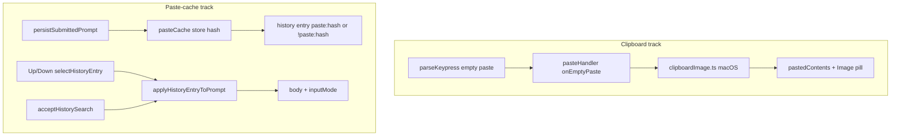

# Phase 5: Clipboard image + paste-cache history

Parent spec: [docs/PLAN-copy-paste-full.md](docs/PLAN-copy-paste-full.md#phase-5-deferred--clipboard-image--paste-cache-history).

**Prerequisite:** Phases 1–4 are landed on the current branch ([`pasteHandler`](src/ui/input/pasteHandler.ts), [`imagePaste`](src/ui/input/imagePaste.ts), [`expandSubmit`](src/ui/input/expandSubmit.ts), [`shouldPersistPromptHistory`](src/ui/input/promptSubmission.ts) skipping `> HISTORY_INLINE_MAX`, [`beginUserTurn` with images](src/context/contextManager.ts)).

Phase 5 has **two largely independent tracks** (separate commits/PR slices recommended).



---

## Track A — macOS clipboard image

### Problem today

- [`parseKeypress`](src/ui/input/parseKeypress.ts) already emits `{ kind: "paste", text: "", isPasted: true }` for empty bracketed paste (tested in [`parseKeypress.test.ts`](src/ui/input/__tests__/parseKeypress.test.ts)).
- [`pasteHandler.submitPaste`](src/ui/input/pasteHandler.ts) **no-ops** when `text.length === 0` (test: “ignores empty submitPaste”).
- [`chatPromptSession`](src/ui/chatPromptSession.ts) routes all pastes through `submitPaste` only — no clipboard probe.

### New module: [`src/ui/input/clipboardImage.ts`](src/ui/input/clipboardImage.ts)

| Export | Responsibility |
|--------|----------------|
| `tryReadImageFromClipboard(): Promise<ClipboardImageResult>` | Platform-gated read; non-darwin → `{ ok: false, reason: "unsupported_platform" }` |
| `encodeClipboardBytes(bytes, mediaType, filename?)` | Build `data:image/...;base64,...` (reuse sniff/MIME logic from [`imagePaste.ts`](src/ui/input/imagePaste.ts) — extract shared `sniffMediaType` / max-bytes check to avoid duplication) |

**macOS read strategy (ordered):**

1. **`osascript`** — read clipboard as `«class PNGf»` / JPEG pasteboard types; base64-decode in Node. No new npm dependency.
2. **Optional fallback:** if `pngpaste` is on `PATH`, spawn once; document in README as optional Homebrew install (`brew install pngpaste`). `pngpaste` outputs PNG bytes directly.

**Subprocess timeout (required):** both `osascript` and `pngpaste` runs must use a **hard timeout** (e.g. 3–5s via `AbortSignal` / `child_process` kill). Latency risk is not fully covered by `deliveryActive` alone — a stuck subprocess would otherwise leave paste feeling wedged until the user kills the agent.

**TIFF / unsupported clipboard types:**

- **Do not** advertise TIFF in the primary read path unless we can produce PNG/JPEG bytes without `sharp`.
- **TIFF-only clipboards** (common on macOS for some apps): treat as **no image** after read attempt — same silent no-op as empty clipboard. Do not pass TIFF bytes through validation expecting PNG/JPEG/GIF/WebP sniff to pass.
- **`osascript`:** prefer PNGf / JPEG classes only; skip TIFF pasteboard types in MVP.
- **`pngpaste`:** already emits PNG; use when AppleScript path fails.

**Validation:** same limits as path paste — [`MAX_IMAGE_BYTES`](src/ui/input/imagePaste.ts) (8 MiB), magic-byte sniff, supported types **PNG / JPEG / GIF / WebP** only; BMP → `unsupported_type` with existing [`imagePasteFailureMessage`](src/ui/input/imagePaste.ts) pattern.

**Synthetic metadata:** `filename: "clipboard.png"` (or extension from sniffed MIME).

### Paste handler contract

Extend [`PasteHandlerCallbacks`](src/ui/input/pasteHandler.ts):

```ts
onEmptyPaste?: () => void | Promise<void>;
```

**Behavior change in `submitPaste`:**

- When `text.length === 0` **and** `meta.isPasted === true` **and** `onEmptyPaste` is defined:
  - Run through existing **`runDelivery` / `deliveryActive`** path (same Enter-guard semantics as image path I/O — do not leave a gap after debounce).
  - `await onEmptyPaste()` inside try/finally; **no** `onTextPaste("")`.
- When `text.length === 0` and not pasted (or no callback): keep current no-op.

**Tests ([`pasteHandler.test.ts`](src/ui/input/__tests__/pasteHandler.test.ts)):**

- Empty + `isPasted: true` → `onEmptyPaste` called; `isPasting()` true until promise settles.
- Empty + not pasted → still no-op.
- `dispose()` during pending `onEmptyPaste` → no session mutation (mirror Phase 4 delivery generation tests).

### Session wiring ([`chatPromptSession.ts`](src/ui/chatPromptSession.ts))

Add `onEmptyPaste` (chat / `inputMode === "prompt"` only; bash: omit callback or no-op):

```ts
onEmptyPaste: async () => {
  const deliveryToken = captureSessionDeliveryToken();
  const result = await tryReadImageFromClipboard();
  if (!isSessionDeliveryValid(deliveryToken)) return;
  if (!result.ok) return; // silent no-op when clipboard has no image (avoid noise on empty text paste)
  // Same registry + buildImagePastePill + insertText flow as onImagePaths success branch
},
```

Reuse existing pill/registry/submit expansion — **no** new pill token type.

### Dedicated tests: [`clipboardImage.test.ts`](src/ui/input/__tests__/clipboardImage.test.ts)

| Case | Expectation |
|------|-------------|
| Platform gating | non-darwin → `unsupported_platform` without spawning |
| Child-process failure | mocked `execFile` / spawn error → `read_error` or graceful `ok: false` |
| No image on clipboard | empty / non-image pasteboard → `ok: false` |
| Timeout | hung subprocess killed; returns within budget; no hang |
| Too large | bytes > `MAX_IMAGE_BYTES` → failure reason |
| Unsupported type | BMP sniff / bad magic → `unsupported_type` |
| Success encodings | PNG, JPEG, GIF, WebP → `data:image/...;base64,...` with matching MIME |

Mock subprocess I/O; do not require a real macOS clipboard in CI.

### Optional stretch (not required for Phase 5 ship)

- Slash command `/image-paste` or documented shortcut that calls the same `tryReadImageFromClipboard` path (useful when bracketed empty paste is unavailable).

### Platform scope

- **Ship:** macOS (`process.platform === "darwin"`).
- **Other platforms:** `onEmptyPaste` may still run but returns unsupported; no user error unless we add an explicit opt-in command.

---

## Track B — Paste-cache + history v2

### Problem today

[`shouldPersistPromptHistory`](src/ui/input/promptSubmission.ts) returns `false` when `submission.text.length > 1024`, so large expanded pastes are **never** recorded ([`promptComposer.ts`](src/ui/promptComposer.ts) L203–226). Users cannot recall them with Up/Down.

### New module: [`src/ui/pasteCache.ts`](src/ui/pasteCache.ts)

**Storage layout (per full plan):**

```
~/.propio/paste-cache/<sha256-hex>.txt
```

- **Global** cache (content-addressed, deduped across workspaces) — distinct from workspace-scoped [`prompt-history.json`](src/index.ts) under `~/.propio/sessions/<workspace-hash>/`.
- Hash: `sha256` of UTF-8 expanded text (full 64-char hex digest in filename).
- **Chat ref string:** `paste:<hash>` where `<hash>` matches `[a-f0-9]{64}`.
- **Bash ref string:** `!paste:<hash>` — preserves bash mode on restore ([`getModeFromInput`](src/ui/inputModes.ts) keys off leading `!`).

### Ref validation (required)

Do **not** resolve arbitrary `entry.startsWith("paste:")` — validate before any filesystem access:

```ts
const PASTE_REF_PATTERN = /^(?<bash>!)?paste:(?<hash>[a-f0-9]{64})$/;

export function parsePasteHistoryRef(entry: string): { hash: string; bash: boolean } | null;
// Accepts "paste:<64-hex>" and "!paste:<64-hex>" only.
// Rejects: bare 64-hex, "../", short hash, uppercase hex, "paste:foo notes", missing "paste:" literal.
```

`PasteCache.read` uses parsed `hash` only: `path.join(cacheDir, `${hash}.txt`)` — no user-controlled path segments beyond the validated hex name.

### `PasteCache` interface (explicit)

```ts
export interface PasteCache {
  /** Content-addressed write; returns sha256 hex digest. Sync, atomic temp + rename. */
  store(text: string): string;
  /** Read cache file by hash; null if missing. */
  read(hash: string): string | null;
  /** `parsePasteHistoryRef(entry)` then `read(hash)`; null if not a ref or file missing. */
  resolve(entry: string): string | null;
}

export interface PasteCacheOptions {
  cacheDir?: string; // default: ~/.propio/paste-cache
}

export function createPasteCache(options?: PasteCacheOptions): PasteCache;
```

`parsePasteHistoryRef` / `isPasteHistoryRef` remain exported helpers (validation only; no I/O).

- **`PromptComposerOptions`** gains `pasteCache?: PasteCache` for `buildPromptHistoryEntry` on submit.
- **`ChatPromptSessionOptions`** gains the same `pasteCache` — history restore runs inside [`chatPromptSession.ts`](src/ui/chatPromptSession.ts) (`selectHistoryEntry`, `syncFromSearchState`), not only in the composer. Composer passes its `pasteCache` instance through when creating the session.
- Tests **must** use a temp `cacheDir`; never write to real `~/.propio` in unit tests.

| Method | Behavior |
|--------|----------|
| `store(text)` | Sync write; file mode `0o600`; mkdir cache dir `0o700` on first use; return hash |
| `read(hash)` | Validated `[a-f0-9]{64}` only; missing file → `null` |
| `resolve(entry)` | Parse ref → `read(hash)`; invalid ref → `null` |

### Sync/async decision (explicit)

**Choose synchronous `PasteCache.store` in Phase 5.**

| Factor | Choice |
|--------|--------|
| [`persistSubmittedPrompt`](src/ui/promptComposer.ts) | Already synchronous on submit path |
| [`promptHistory.store.record`](src/ui/promptHistory.ts) | Sync API; persistence to disk is async *scheduled* separately |
| Failure handling | `pasteCache.store` wrapped in try/catch in `buildPromptHistoryEntry`; on failure **skip** history record for that submit (same best-effort posture as history persist errors) — do not block submission |

Do **not** make `persistSubmittedPrompt` async in Phase 5; that would ripple through composer settlement and tests without user benefit.

### Security and privacy

- Create `~/.propio/paste-cache` with **`0o700`**; cache files **`0o600`** where the platform allows (`fs.mkdir` / `writeFile` mode).
- **README warning:** large prompts and pasted secrets may be stored indefinitely under `~/.propio/paste-cache/` until manually removed.
- **Follow-up (out of scope):** `propio cache clear` or documented `rm -rf ~/.propio/paste-cache` — note in README risks section.

**No GC in MVP** — acceptable; note in README that cache grows with unique large pastes.

### History file schema v2

[`promptHistory.ts`](src/ui/promptHistory.ts) today:

```ts
interface PromptHistoryFile { version: 1; entries: string[]; }
```

**v2:** same `entries: string[]` shape; entries may be inline text, `paste:<hash>`, or `!paste:<hash>`. Bump `version: 2` on save.

**Load (backward compatible):**

- Accept `version: 1` and `version: 2` — both use `entries: string[]`.
- Malformed / unknown version → `[]` (existing behavior).

### Recording pipeline

1. **`buildPromptHistoryEntry(submission, pasteCache)`** (new helper in [`promptSubmission.ts`](src/ui/input/promptSubmission.ts) or `pasteCache.ts`):
   - Image-only → still **skip** (unchanged MVP).
   - `submission.text.length <= HISTORY_INLINE_MAX` → return `submission.text` (chat) or [`formatBashHistoryEntry`](src/ui/inputModes.ts)(trimmed) for bash.
   - `> HISTORY_INLINE_MAX` → `pasteCache.store(submission.text)` → return `paste:<hash>` for chat, **`!paste:<hash>`** for bash (`submission.inputMode === "bash"`).

2. **`shouldPersistPromptHistory`** — remove the `length > HISTORY_INLINE_MAX` early `return false`; keep slash/image-only rules.

3. **`persistSubmittedPrompt`** — use `buildPromptHistoryEntry` instead of raw `submission.text` when calling `historyStore.record`.

**Important:** History always stores **expanded** `submission.text`, never `displayText` with pills ([Phase 3 policy](docs/PLAN-copy-paste-phase-3.md)).

### Restoring history into the buffer (single helper)

Resolved cache text has **no** leading `!`, so mode must come from the **stored** history entry, not from the resolved body. Use one helper everywhere a history selection becomes prompt state:

```ts
export interface AppliedHistoryEntry {
  buffer: string;
  inputMode: InputMode;
}

/** Mode from stored entry; body from cache when entry is a paste ref. */
function formatMissingPasteRefFallback(ref: { hash: string; bash: boolean }): string {
  // `!` is a history-storage marker only — never put `!paste:…` in the editable bash buffer.
  return `paste:${ref.hash}`;
}

export function applyHistoryEntryToPrompt(
  stored: string,
  pasteCache: PasteCache,
): AppliedHistoryEntry {
  const pasteRef = parsePasteHistoryRef(stored);
  if (pasteRef) {
    const body = pasteCache.read(pasteRef.hash);
    return {
      inputMode: pasteRef.bash ? "bash" : "prompt",
      buffer: body ?? formatMissingPasteRefFallback(pasteRef),
    };
  }

  if (getModeFromInput(stored) === "bash") {
    return {
      inputMode: "bash",
      buffer: parseBashHistoryEntry(stored),
    };
  }

  return { inputMode: "prompt", buffer: stored };
}
```

**Restore rule:** detect mode from the **stored** entry (`parsePasteHistoryRef` or `getModeFromInput`), then resolve body for the buffer. Never call `getModeFromInput` on resolved cache text alone — `!paste:<hash>` would become prompt mode incorrectly.

Call sites (all required in Phase 5):

| Call site | File | Notes |
|-----------|------|--------|
| Up/Down | [`selectHistoryEntry`](src/ui/chatPromptSession.ts) | `const applied = applyHistoryEntryToPrompt(stored, pasteCache)`; set `inputMode`, `buffer = applied.buffer`, **`cursor = applied.buffer.length`**, `syncActiveFooter` if mode changed |
| Reverse history search (live preview) | [`syncFromSearchState`](src/ui/chatPromptSession.ts) (~L898) | Use `applyHistorySearchSelection` (see caution above) — helper **only** when previewing a real `matches[i]` entry |
| Search exit with accept / cancel | [`exitSearch`](src/ui/chatPromptSession.ts) (~L1170) | Same shared `applyHistorySearchSelection`; cancel / no-match restores **`searchDraftInputMode`** |

**Ctrl+R + `!paste:<hash>`:** accepting a search match must restore **bash mode and** expanded command text. `syncFromSearchState` today only copies `selection.buffer`; after Phase 5 it must apply `applyHistoryEntryToPrompt` so `inputMode === "bash"` when the stored match was `!paste:…`.

### History search: preserve draft `inputMode` (implementation caution)

[`acceptHistorySearch`](src/ui/historySearch.ts) returns `originalBuffer` when there is **no selected match** (`matches.length === 0` or `selectedMatchIndex < 0`). [`cancelHistorySearch`](src/ui/historySearch.ts) always returns the pre-search draft. In both cases the buffer is the user’s **in-progress edit**, not a `historySnapshot` entry.

Bash drafts often **do not** start with `!` (the prompt buffer stores the command body only). Calling `applyHistoryEntryToPrompt` on that text will classify it as **prompt** mode and can flip a bash draft back to chat when the user cancels search or accepts with no match.

**Required behavior:**

| Path | Apply `applyHistoryEntryToPrompt`? | `inputMode` |
|------|-----------------------------------|-------------|
| Preview/accept a **history match** (`matches[selectedMatchIndex]`) | **Yes** | From helper |
| Cancel (`cancelHistorySearch`) | **No** | Restore saved draft mode |
| Accept with **no match** (falls back to `originalBuffer`) | **No** | Restore saved draft mode |
| Live preview while query yields **zero matches** | **No** | Restore saved draft mode |

**Recommended wiring:**

1. On **enter search** ([`enterSearch`](src/ui/chatPromptSession.ts)), capture `searchDraftInputMode = inputMode` alongside existing `draftSnapshot` / `startHistorySearch(…, originalBuffer, …)`.
2. Centralize search → prompt apply in one function, e.g. `applyHistorySearchSelection(selection, searchState)`:
   ```ts
   const selectedEntry =
     searchState.matches.length > 0 && searchState.selectedMatchIndex >= 0
       ? searchState.matches[searchState.selectedMatchIndex]
       : undefined;

   if (selectedEntry === undefined) {
     buffer = searchState.originalBuffer;
     cursor = searchState.originalCursor; // cancel; accept-with-no-match may use buffer.length per acceptHistorySearch — preserve mode either way
     inputMode = searchDraftInputMode;
     return;
   }

   const applied = applyHistoryEntryToPrompt(selectedEntry, pasteCache);
   buffer = applied.buffer;
   cursor = applied.buffer.length;
   inputMode = applied.inputMode;
   ```
3. **`syncFromSearchState`** and **`exitSearch`** both call this helper — do not call `applyHistoryEntryToPrompt(selection.buffer)` blindly on whatever `acceptHistorySearch` returns.

**Alternative (acceptable):** only invoke the helper when `isPasteHistoryRef(buffer)` or `getModeFromInput(buffer) === "bash"` (stored `!…` entries) or `historySnapshot.includes(buffer)` — but capturing `searchDraftInputMode` is simpler and covers ordinary bash drafts reliably.

**Test:** enter bash mode, type `git status` (no `!` in buffer), Ctrl+R then Esc → still bash with original buffer. Same draft, accept with no matches → still bash.

**Inline bash (unchanged):** stored `!git status` **history entry** → `applyHistoryEntryToPrompt` → bash mode + `parseBashHistoryEntry` body.

- **Missing cache file:** show `paste:<hash>` in the buffer (no leading `!`, even when `inputMode === "bash"`). Optional `editorStatus` (“Paste no longer in cache”). Chat missing ref: same `paste:<hash>` string.
- **Live `historySnapshot`:** keep refs on disk/in-memory list; resolve only when user selects an entry.

### History search limitation (document as known)

[`historySearch.ts`](src/ui/historySearch.ts) searches raw snapshot strings — `paste:<hash>` entries will **not** match words inside the cached body in MVP.

**However:** when the user accepts a visible `paste:<hash>` or `!paste:<hash>` match (or cycles to one), **must** apply `applyHistoryEntryToPrompt` (body + correct `inputMode`). Defer indexing cached content for search-only discovery.

### Tests

| File | Cases |
|------|--------|
| **`pasteCache.test.ts`** (new) | inject `cacheDir`; store → read; dedup; `0o700`/`0o600` where assertable; `parsePasteHistoryRef` rejects malformed refs; path traversal attempts rejected |
| **`clipboardImage.test.ts`** (new) | see Track A table |
| **`promptHistory.test.ts`** | load v1 unchanged; save v2; round-trip `paste:` and `!paste:` entries |
| **`promptSubmission.test.ts`** | `shouldPersistPromptHistory` true for 1025-char text; bash large entry → `!paste:<hash>`; chat → `paste:<hash>` |
| **`promptComposer.test.ts`** | inject `pasteCache` with temp dir; large chat submit → `paste:…`; large bash submit → `!paste:…` |
| **`chatPromptSession.test.ts`** | Up/Down: `paste:…` → prompt + body, cursor at end; `!paste:…` → bash + body; Ctrl+R accept on `!paste:…` → bash + body, cursor at end; missing `!paste:…` cache → bash + `paste:<hash>`; **bash draft without `!`, Ctrl+R then Esc → still bash** |

---

## README updates

Extend [README.md](README.md) “Pasting image file paths” section:

- **Clipboard (macOS):** Cmd+V with an image on the clipboard (no text) inserts `[Image #N]` in chat mode; requires bracketed paste (TTY). TIFF-only clipboards unsupported in MVP.
- **Large paste history:** submissions longer than 1024 characters are stored as `paste:<hash>` (or `!paste:<hash>` in bash mode) and restored from `~/.propio/paste-cache/` on Up/Down and when accepting a history-search match.
- **Privacy:** cache may retain sensitive pasted content; location and manual cleanup note.
- Optional `pngpaste` note for environments where AppleScript is insufficient.

Remove “planned separately” wording for these two features once shipped.

---

## Suggested commit order

1. **`pasteCache.ts`** + DI (`PromptComposerOptions` + `ChatPromptSessionOptions`) + ref validation + `applyHistoryEntryToPrompt` at all restore sites + bash `!paste:` recording + tests.
2. **`clipboardImage.ts`** + timeout + shared sniff helper + `onEmptyPaste` + `clipboardImage.test.ts` + session wiring.
3. **README** + cross-link from [PLAN-copy-paste-full.md](docs/PLAN-copy-paste-full.md).

Tracks 1 and 2 can land in either order; README last.

---

## Validation

Per [AGENTS.md](AGENTS.md):

- `npm test`
- `npm run build`
- `npm run format:check`
- `npx fallow audit`

Manual smoke (macOS TTY): empty image clipboard paste; submit 2KB paste → Up restores full text; bash long command → Up restores bash mode; Ctrl+R accept on `paste:…` entry restores body; verify `~/.propio/paste-cache/` permissions.

---

## Risks

| Risk | Mitigation |
|------|------------|
| Empty paste fires on terminals without real clipboard image | Silent no-op when `tryReadImageFromClipboard` fails |
| `osascript` / `pngpaste` hang | Hard subprocess timeout + `deliveryActive` Enter guard |
| Large bash history restores as prompt mode | Store `!paste:<hash>`; bash detect on `!` prefix before resolve |
| History search accept leaves ref in buffer or wrong mode | `applyHistoryEntryToPrompt` sets body + `inputMode` in `syncFromSearchState` / `exitSearch` |
| `!paste:<hash>` restores as prompt after resolve | Mode from stored entry via `parsePasteHistoryRef`, not `getModeFromInput(resolvedBody)` |
| History search cancel flips bash → prompt | Only `applyHistoryEntryToPrompt` on real `matches[i]`; restore `searchDraftInputMode` on cancel/no-match |
| Malformed ref → path traversal | `parsePasteHistoryRef` — only `[a-f0-9]{64}` filenames |
| Secrets in global cache | `0600`/`0700` + README warning |
| History search misses cached body text | Document; resolve on accept only |
| Cache growth | Document; no GC in MVP |
| Duplicate sniff logic | Extract small shared module or export from `imagePaste.ts` |

---

## Explicitly out of scope (remain deferred)

- `optionalDependencies` / **`sharp`** (resize, BMP conversion, TIFF conversion)
- Paste-cache GC / TTL / `propio cache clear` command
- Non-macOS clipboard APIs
- Indexing cached paste bodies for history search discovery
- Phase 6 transcript polish (“N images attached”) — separate plan section
