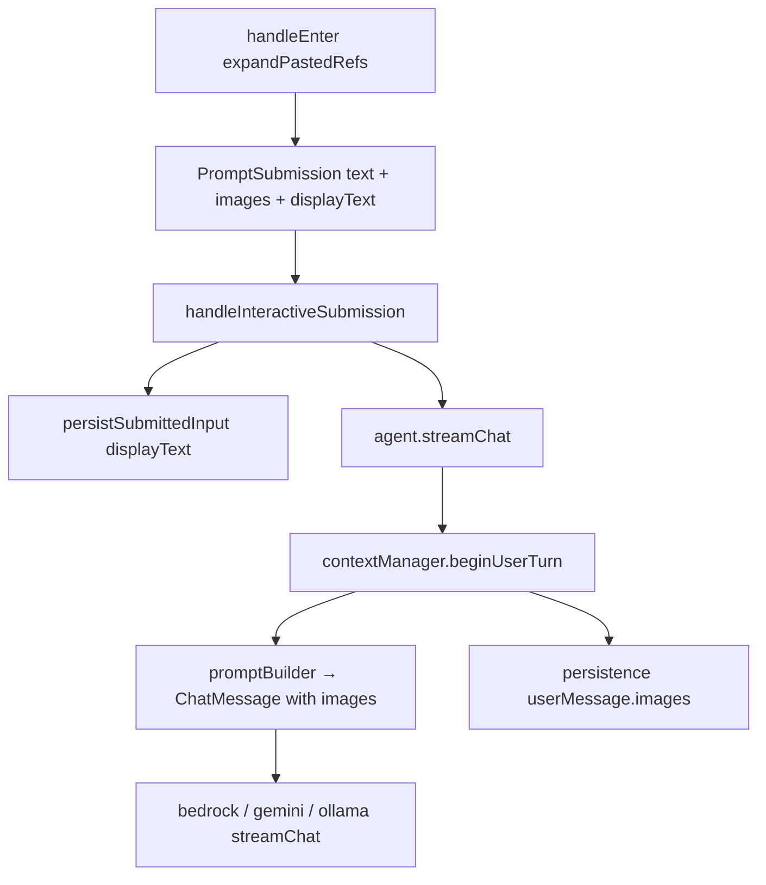

# Phase 6: Agent / context multimodal wiring + transcript polish

Parent spec: [docs/PLAN-copy-paste-full.md](PLAN-copy-paste-full.md#phase-6--agent--context-multimodal-wiring).

**Prerequisite:** Phases 1–5 are landed ([`pasteHandler`](src/ui/input/pasteHandler.ts), [`expandSubmit`](src/ui/input/expandSubmit.ts), [`imagePaste`](src/ui/input/imagePaste.ts), [`clipboardImage`](src/ui/input/clipboardImage.ts), [`pasteCache`](src/ui/pasteCache.ts), [`PromptSubmission`](src/ui/input/promptSubmission.ts) through composer / REPL / agent).

Phase 6 closes the loop from **paste/drop/clipboard → provider request → session save/load → live transcript**. Much of the “wire `images` into context” work was started in Phase 4; this phase is primarily **verification, persistence round-trip, provider E2E tests, budgeting, and optional transcript polish** called out as deferred in earlier plans.



---

## Current baseline

| Piece | Status |
|-------|--------|
| `beginUserTurn(content, images?)` → `turn.userMessage.images` | **Done** ([`contextManager.ts`](src/context/contextManager.ts) L324–341) |
| `Agent.streamChat(submission)` → `beginUserTurn(submission.text, submission.images)` | **Done** ([`agent.ts`](src/agent.ts) L2150–2151) |
| `handleInteractiveSubmission` → `isSubmissionEmpty`, slash + images reject | **Done** ([`index.ts`](src/index.ts)) |
| Live transcript uses `submission.displayText` (not expanded `text`) | **Done** ([`handleChatSubmission`](src/index.ts) → `persistSubmittedInput`) |
| `promptBuilder` pushes `turn.userMessage` unchanged (incl. `images`) | **Done** ([`promptBuilder.ts`](src/context/promptBuilder.ts) L561, L594) |
| Providers accept `ChatMessage.images` (data URLs) | **Done** (Phase 4 contract; no provider changes expected) |
| `contextManager` unit test for `beginUserTurn` + images | **Done** ([`contextManager.test.ts`](src/context/__tests__/contextManager.test.ts)) |
| Interactive integration: displayText + image-only + slash guard | **Done** ([`chatSubmission.test.ts`](src/__tests__/chatSubmission.test.ts)) |
| **`agent.test.ts`**: `PromptSubmission.images` → provider `ChatRequest.messages` | **Done** |
| **`promptBuilder.test.ts`**: user turn with `images` in `plan.messages` | **Done** |
| **`persistence.test.ts`**: round-trip `turn.userMessage.images` (data URL, utf8) | **Done** |
| Transcript multi-image summary (caption-safe) | **Missing** (deferred from Phase 4/5) |
| `messageChars` / token budget includes image payload size | **Done** |
| Test helpers modeling real `text` vs `displayText` split | **Done** ([`testHelpers.ts`](src/__tests__/testHelpers.ts)) |

**Phase 6 ship bar:** provider path, builder path, persistence (incl. raw JSON assertions), and **`messageChars` budgeting**. Transcript formatter and context-inspector hints are **optional follow-ups** (see Part 4).

---

## Pre-implementation decisions (resolve before coding)

| Decision | Choice | Rationale |
|----------|--------|-----------|
| **Provider surface** | No changes to [`bedrock.ts`](src/providers/bedrock.ts), [`gemini.ts`](src/providers/gemini.ts), etc. | Phase 4 locked data-URL `PromptImage` shape; providers already map `msg.images`. |
| **Agent `text` vs `images`** | Keep split: expanded markers in `submission.text`, bytes in `submission.images` | Matches expand policy; model gets filename hints without base64 in text. |
| **`@file` + pasted images** | Independent: `attachFileMentions(submission.text)` only; images do not auto-trigger file tools | Avoid surprising tool runs on image-only turns; document in README if needed. |
| **Transcript source of truth** | Always start from **`submission.displayText`**; never expanded multi‑KB bodies or raw base64 | Phase 6 may **append** a suffix only (below); never replace user captions. |
| **Multi-image transcript line (optional)** | **First:** strip pills; if nothing left → `(N images attached)`. **Then** (non-empty remainder): leading/trailing caption layout only — e.g. `compare these [Image #1] [Image #2]` → `compare these (2 images attached)`. **Interleaved** pills in caption → unchanged. Single image: keep `[Image #1]`. | Image-only path does not use `(.+?)` caption regex; avoids mis-parsing `[Image #1]\n[Image #2]`. |
| **Session `userMessage.content` on disk** | Keep **expanded markers** in `content` + full `images[]` in JSON (current behavior) | Rehydration for providers needs bytes; markers keep session files human-glanceable. Do **not** strip images from persistence in MVP. |
| **Token / char budgeting** | **Required for Phase 6:** add image byte length to `messageChars()` when `msg.images` present (data URL payload after `,` or `Uint8Array.byteLength`) | Parent plan and compaction depend on this; omitting it allows quiet underestimation on image-heavy sessions. Document as approximate (same `chars/4` heuristic). |
| **stdin / non-TTY one-shot** | No image support in `createPlainSubmission(stdin)` path | Out of scope unless explicitly requested; Phase 6 documents limitation only. |
| **Test data URLs** | Shared constant: **valid minimal 1×1 PNG** data URL (full base64, not truncated) in test helpers | Keeps mocked provider tests representative even without real I/O. |

**Shared test constant (example):**

```ts
/** Valid 1×1 PNG — use everywhere Phase 6 needs a data URL. */
export const TEST_PNG_DATA_URL =
  "data:image/png;base64,iVBORw0KGgoAAAANSUhEUgAAAAEAAAABCAYAAAAfFcSJAAAADUlEQVR42mP8z8BQDwAEhQGAhKmMIQAAAABJRU5ErkJggg==";
```

---

## Part 1 — Agent → provider E2E tests

**Files:** [`src/__tests__/agent.test.ts`](src/__tests__/agent.test.ts), [`src/__tests__/testHelpers.ts`](src/__tests__/testHelpers.ts)

### 1a — Test helpers

**Provider / agent path** — expanded text + images (displayText defaults to text when omitted):

```ts
export function userSubmissionWithImages(
  text: string,
  images: PromptImage[],
  displayText?: string,
): PromptSubmission {
  return {
    text,
    displayText: displayText ?? text,
    inputMode: "prompt",
    images,
  };
}
```

**Transcript / REPL path** — models the real post-expand split:

```ts
export function imagePillSubmission(opts: {
  text: string; // e.g. "[Attached image: photo.png]" or "compare these [Attached image: a.png] ..."
  displayText: string; // e.g. "[Image #1]" or "compare these [Image #1] [Image #2]"
  images: PromptImage[];
}): PromptSubmission {
  return { ...opts, inputMode: "prompt" };
}
```

Use `TEST_PNG_DATA_URL` for `images` in both helpers unless a test specifically needs `Uint8Array`.

### 1b — Required cases

| Test | Assert |
|------|--------|
| Caption + attachment | `userSubmissionWithImages("describe this [Attached image: photo.png]", [TEST_PNG_DATA_URL])` → **first** `streamChatCalls[0].messages`: user message with `images?.length === 1`, `images[0] === TEST_PNG_DATA_URL`, `content` includes caption + marker (not raw base64) |
| Image-only (marker-only `text`) | `userSubmissionWithImages("[Attached image: photo.png]", [TEST_PNG_DATA_URL])` → same provider asserts; `content` is marker-only; `images` still present |
| **Second provider call (tool loop)** | Mock provider that returns a tool call on call 1 and a final answer on call 2; after `streamChat` completes, inspect **`streamChatCalls[1].messages`** (not only `[0]`): the **original** user message with `images` is still present — filter `messages.filter(m => m.role === "user" && m.images?.length)` and assert at least one match with the same data URL |
| Compaction / rebuild (if covered elsewhere) | Optional: same user+images survives context-length retry rebuild — only if an existing agent test pattern already exercises retry |

**Helper:** `findUserMessageWithImages(messages: ChatMessage[]): ChatMessage | undefined` — avoids asserting the wrong user index when system / tool messages are interleaved.

Implementation: existing `MockProvider` / `streamChatCalls`; no real network.

---

## Part 2 — Prompt builder tests

**File:** [`src/context/__tests__/promptBuilder.test.ts`](src/context/__tests__/promptBuilder.test.ts)

Add one focused case:

- Build request with a current or recent turn whose `userMessage` is `{ role: "user", content: "[Attached image: x.png]", images: [TEST_PNG_DATA_URL] }`.
- Assert `plan.messages` includes that message with matching `images` (deep equality on data URL string).
- Assert builder does **not** duplicate images into `content`.

No builder logic change expected—test guards regression.

---

## Part 3 — Session persistence round-trip

**File:** [`src/context/__tests__/persistence.test.ts`](src/context/__tests__/persistence.test.ts)

For each case, assert in **three layers** (do not skip raw JSON):

1. **Serialized JSON** — `JSON.parse(serializeSession(...))`: `turns[0].userMessage.images` exists on the **user message** object (not nested under entries/artifacts); `encoding` and `data` shape match expectations; data URL string unchanged (no accidental re-encoding or truncation).
2. **Restored state** — `restoreConversationState` / `importState`: `turns[0].userMessage.images[0]` matches input.
3. **Isolation (binary case only)** — after restore, mutating the restored `Uint8Array` does **not** change bytes in the original pre-serialize buffer (clone semantics).

| Case | Steps | JSON assert (examples) | Restored assert |
|------|-------|------------------------|-----------------|
| User turn images (utf8 data URL) | `beginUserTurn("See [Attached image: a.png]", [TEST_PNG_DATA_URL])` → complete turn → serialize | `userMessage.images[0].encoding === "utf8"`; `data === TEST_PNG_DATA_URL` | Same string on `turn.userMessage.images[0]` |
| User turn images (binary) | `beginUserTurn("pic", [new Uint8Array(PNG_MAGIC)])` → serialize | `encoding === "base64"`; `data` is valid base64 decoding to same bytes | `Uint8Array` equal; **alias check:** `restored[0][0] = 0xff` does not mutate original `PNG_MAGIC` buffer |

Confirms [`persistImage`](src/context/persistence.ts) / [`restoreImage`](src/context/persistence.ts) for **user** messages, not only tool artifacts.

---

## Part 4 — Transcript and display polish (optional)

Not part of the Phase 6 **ship bar**. Land only if timeboxed; otherwise defer to a small follow-up PR.

### 4a — Display formatter

**New (small):** `formatSubmissionDisplayText(displayText: string): string` in [`src/ui/input/promptSubmission.ts`](src/ui/input/promptSubmission.ts) or [`src/ui/formatting.ts`](src/ui/formatting.ts).

Rules (order matters):

1. Let `imageCount` = number of `[Image #N]` matches. If `imageCount < 2` → unchanged.
2. If any `[Pasted text #` token → unchanged.
3. **Image-only buffer (before any caption regex):**

   ```ts
   const withoutImages = displayText.replace(imagePillPattern, "").trim();
   if (withoutImages.length === 0) {
     return `(${imageCount} images attached)`;
   }
   ```

   This handles `[Image #1]\n[Image #2]` without relying on a non-greedy `(.+?)` group (which would not yield an empty caption).

4. **Leading/trailing caption only** (when `withoutImages.length > 0`): match `displayText` against optional leading pills + **caption with no `[Image #` inside** + optional trailing pills — e.g. `^(?:\[Image #\d+\]\s*)*(.+?)(?:\s*\[Image #\d+\])*$` where group 1 contains no pill tokens. If no match (pills between caption words, e.g. `compare [Image #1] with [Image #2]`) → **unchanged**.
5. On match: `caption = group(1).replace(/\s+/g, " ").trim()` → **`${caption} (${imageCount} images attached)`** (caption is non-empty by step 3).
6. **Caveat:** do not invent a caption from interleaved layouts; when in doubt, return `displayText` unchanged.

Wire at **single call site**: [`handleChatSubmission`](src/index.ts) → `persistSubmittedInput(formatSubmissionDisplayText(...))` only when that path renders user text. **Retained TTY:** `persistSubmittedInput` remains no-op ([`terminal.ts`](src/ui/terminal.ts) L238–244).

### 4b — Tests (if formatter ships)

| Input `displayText` | Expected |
|---------------------|----------|
| `[Image #1]\n[Image #2]` | `(2 images attached)` |
| `compare these [Image #1] [Image #2]` | `compare these (2 images attached)` |
| `compare [Image #1] with [Image #2]` | unchanged (pills interleaved in caption) |
| `[Image #1]` | `[Image #1]` (unchanged) |
| `fix [Pasted text #1] [Image #1] [Image #2]` | unchanged |

Use `imagePillSubmission` in [`chatSubmission.test.ts`](src/__tests__/chatSubmission.test.ts) when asserting `persistSubmittedInput` receives the formatted **display** shape.

### 4c — Context inspector (nice but separate)

Append ` (N image(s))` to inspector lines when `turn.userMessage.images?.length` — **not** in the Phase 6 ship bar. Track as a tiny follow-up if not bundled with 4a.

---

## Part 5 — Diagnostics / budgeting (required)

**File:** [`src/diagnostics.ts`](src/diagnostics.ts)

Update `messageChars`:

```ts
if (msg.images) {
  for (const image of msg.images) {
    if (image instanceof Uint8Array) {
      chars += image.byteLength;
    } else if (image.startsWith("data:")) {
      const comma = image.indexOf(",");
      chars += comma >= 0 ? image.length - comma - 1 : image.length;
    } else {
      chars += image.length;
    }
  }
}
```

**Test (required):** [`diagnostics.test.ts`](src/diagnostics.test.ts) — user message with `TEST_PNG_DATA_URL` has strictly greater `messageChars` than same `content` without `images`. Optional: context-manager compaction test asserts image-heavy turn affects budget signal.

---

## Part 6 — Documentation

**README** ([README.md](README.md)) — short “How images reach the model” subsection under pasting:

- Pills in the prompt → expand to `[Attached image: …]` + `images` on the user turn.
- Providers receive multimodal user messages; session files store attachments (size/privacy note).
- One-shot stdin mode does not accept pasted images.

**Cross-link:** [PLAN-copy-paste-full.md](PLAN-copy-paste-full.md) Phase 6 section links this file.

---

## Testing strategy (Phase 6)

| File | Cases |
|------|--------|
| `agent.test.ts` | Images on **first** provider request; image-only; **second** `streamChatCalls[1]` retains user+images |
| `promptBuilder.test.ts` | User turn images in `plan.messages` |
| `persistence.test.ts` | Raw JSON + restored state + `Uint8Array` clone isolation |
| `diagnostics.test.ts` | **`messageChars` includes image payload (required)** |
| `promptSubmission.test.ts` | `formatSubmissionDisplayText` only if Part 4 ships |
| Existing | Keep [`chatSubmission.test.ts`](src/__tests__/chatSubmission.test.ts), [`contextManager.test.ts`](src/context/__tests__/contextManager.test.ts) green |

**Manual smoke (macOS TTY):**

1. Paste/drop PNG → submit → verify model responds to image (Bedrock or Gemini).
2. **Disk round-trip:** submit an image turn → exit propio (or start a new process) → **resume the same session** via `/session` (or the project’s session-reload path that reads `~/.propio/sessions/` from disk) → confirm the restored turn still sends `images` on the next provider call (or shows attachment in context state). **Do not** use `/clear` as the primary resume test — `/clear` wipes active context and does not represent “attachment survived on disk.”
3. Two image pills + caption `compare these` → transcript shows **`compare these (2 images attached)`** (or caption + pills if formatter is not shipped); must **not** show summary-only and drop the caption.

---

## Suggested commit order

1. **`TEST_PNG_DATA_URL` + test helpers** + `agent.test.ts` (Part 1).
2. **`promptBuilder.test.ts`** + **`persistence.test.ts`** with raw JSON asserts (Parts 2–3).
3. **`messageChars` + `diagnostics.test.ts`** (Part 5) — **required**, not deferred.
4. **Transcript formatter** (Part 4) — optional follow-up PR.
5. **README** (Part 6).

---

## Validation

Per [AGENTS.md](../AGENTS.md):

- `npm test`
- `npm run build`
- `npm run format:check`
- `npx fallow audit`

---

## Risks

| Risk | Mitigation |
|------|------------|
| Provider tests assert wrong message index | `findUserMessageWithImages`; for tool loop, assert on **`streamChatCalls[1]`** |
| Session files grow large with pasted images | 8 MiB cap at read; README privacy/size note |
| Summary drops or garbles captions | Leading/trailing pill layout only; interleaved pills → unchanged |
| `messageChars` heuristic wrong for data URLs | Payload after comma; document approximation |
| Persistence regression (wrong object / encoding) | Assert parsed JSON **before** restore |
| Restored `Uint8Array` aliases source buffer | Explicit mutation test after import |
| Prompt rebuild drops images (tool loop / context retry) | Second-call provider test; builder test; optional compaction/retry test only if an existing agent test already exercises shrink/rebuild |

---

## Explicitly out of scope

- Provider-specific resize, format conversion, or `sharp` ([full plan deferred items](PLAN-copy-paste-full.md#scope))
- Non-interactive / piped stdin image ingestion
- Storing **display** pills in `userMessage.content` instead of expanded markers
- Base64 in live transcript or prompt history (still forbidden)
- New pill types or expand grammar changes
- Context inspector hints (unless bundled as explicit follow-up)

---

## Phase 6 completion checklist

**Ship bar (required):**

- [x] `agent.test.ts`: `PromptSubmission.images` on provider user message (call 0); **second provider call** still includes user message with `images`
- [x] `promptBuilder.test.ts`: images preserved in built plan
- [x] `persistence.test.ts`: raw serialized JSON asserts + restored state + `Uint8Array` clone isolation
- [x] `messageChars` accounts for image payload + unit test
- [x] README multimodal path documented

**Optional / follow-up:**

- [ ] `formatSubmissionDisplayText` + tests (caption-safe multi-image)
- [ ] Context inspector ` (N image(s))` suffix
- [ ] [PLAN-copy-paste-full.md](PLAN-copy-paste-full.md) Phase 6 section / status updated when ship bar is complete
