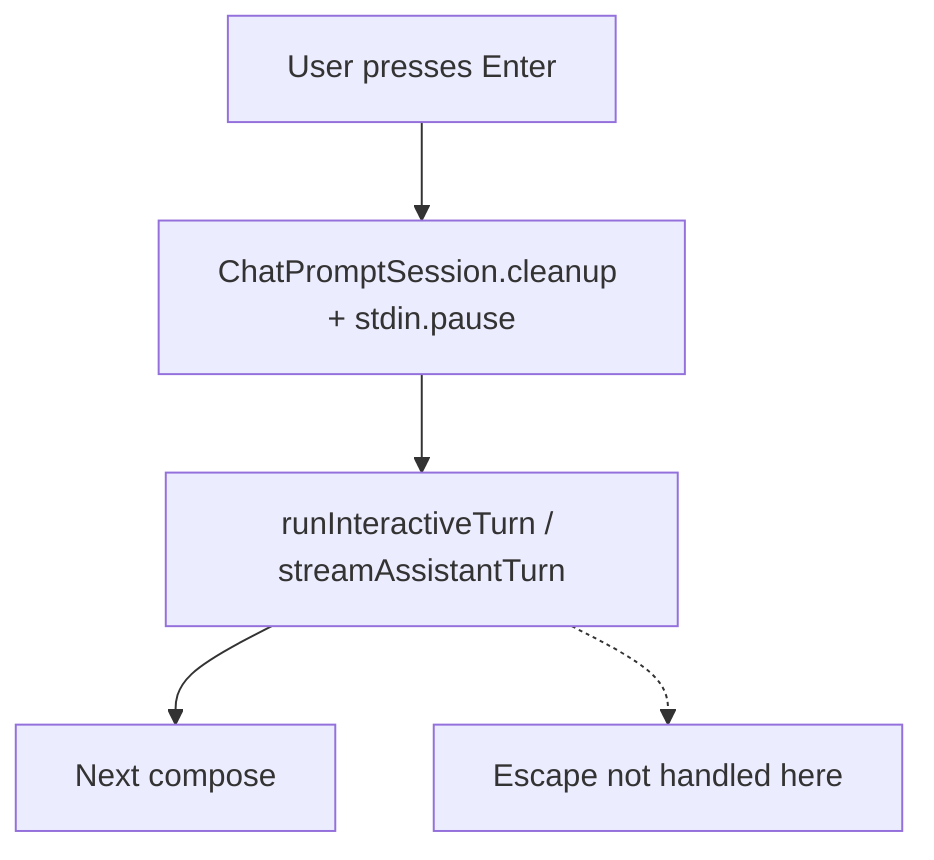

# Escape-to-cancel active turn

## Current state

Propio-agent does **not** use Ink or a keybinding registry. Interactive input is [`readline` + `ChatPromptSession`](../src/ui/chatPromptSession.ts) via [`createPromptComposer`](../src/ui/promptComposer.ts).

| Concern | Today |
|--------|--------|
| **Escape** | Only cancels reverse history search / typeahead while the prompt is open ([`handleSearchCancelKeys`](../src/ui/chatPromptSession.ts) ~1399–1402) |
| **Turn cancel** | `AbortController` + provider checks in [`agent.streamChat`](../src/agent.ts); triggered by **SIGINT** via [`createAbortStateController`](../src/index.ts) ~819–842 |
| **During a turn** | `settlePending` calls `activeChatSession.cleanup()` and `pauseInputStream()` — **no keypress listener** while `runInteractiveTurn` runs |
| **After abort** | [`runInteractiveTurn`](../src/index.ts) catch returns **130**, which propagates out of [`runInteractiveSession`](../src/index.ts) and **ends the whole REPL** — even though the user only wanted to stop the turn |



## Target behavior (aligned with mature project, adapted to this stack)

```mermaid
flowchart TD
  esc[User presses Escape]
  listener[TurnCancelListener on stdin]
  guard{Turn running and not aborted?}
  cancel[cancelActiveTurn]
  abort["abortController.abort(\"escape\")"]
  repl[Return null from runInteractiveTurn]
  prompt[REPL loop: awaitingInput + compose]

  esc --> listener --> guard
  guard -->|yes| cancel --> abort --> repl --> prompt
  guard -->|no| noop[No-op]

  search[Prompt open: search/typeahead]
  esc -.->|existing path| search
```

**Precedence**

1. **Prompt open** (`compose` active): keep existing Escape → cancel search/typeahead in [`chatPromptSession.ts`](../src/ui/chatPromptSession.ts) (unchanged).
2. **Turn running** (`currentAbortController` set, signal not aborted): Escape → cancel turn, **do not** set `shouldExit`.
3. **Idle prompt, no overlay/search**: Escape no-op (optional: dismiss overlay if one is added later during idle).

**Ctrl+C vs Escape**

- **Ctrl+C** (prompt or global SIGINT): keep current semantics — `shouldExit = true`, composer close, abort if running, exit **130**.
- **Escape**: cancel active turn only; **stay in the REPL** and show a short `ui.warn` (e.g. “Turn cancelled.”).

## Implementation plan

### 1. Centralize turn cancellation in `index.ts`

Extend [`AbortStateController`](../src/index.ts) (~745) with something like:

```ts
cancelActiveTurn(source: "escape"): boolean
```

Behavior (mirror mature `onCancel`, scoped to what exists today):

- If no controller or already aborted → return `false`.
- Call `currentAbortController.abort("escape")` so the catch path can distinguish Escape from SIGINT without side-channel state.
- `ui.warn(...)` once only when the method returns `true` (SIGINT already warns separately). Duplicate Escapes should stay silent.
- `ui.setMode("awaitingInput")` (or `"showingResults"` if you prefer a brief post-cancel state — prefer **`awaitingInput`** so the next loop iteration is consistent). `runInteractiveSession` sets this mode again at the top of the loop, but setting it here helps repaint retained TTY state immediately.
- **Do not** call `shouldExit = true` or `activeComposer?.close()`.
- The listener should ignore `false` from `cancelActiveTurn`; do not warn “nothing to cancel” for duplicate Escapes or stale keypresses.

Refactor [`handleSigint`](../src/index.ts) to abort the active controller with reason `"sigint"` when one exists, then apply exit-specific logic (`shouldExit`, `composer.close()`). Keep the existing SIGINT warning separate from the Escape warning. If SIGINT fires between turns, `activeComposer?.close()` should still tear down the REPL as it does today.

### 2. Turn-scoped Escape listener (new small module)

Add [`src/ui/turnCancelListener.ts`](../src/ui/turnCancelListener.ts) (name flexible):

- `createTurnCancelListener({ input, onCancel })` → `{ attach(), detach() }`.
- Use the same keypress shape as chat prompt: raw mode when available, listen for `key.name === "escape"`, and call `input.resume()` during `attach()`. `settlePending()` pauses stdin after submission; without `resume()`, the turn listener will not see Escape.
- Prefer to rely on keypress events already being enabled by the prior custom chat prompt (`createPromptComposer` calls `readline.emitKeypressEvents(inputStream)` when compose starts). Do not call `readline.emitKeypressEvents(input)` on every turn. If the listener unit test needs standalone behavior, either call `readline.emitKeypressEvents` in the test harness or make the listener accept an explicit `enableKeypressEvents` dependency that defaults to no-op in production wiring.
- On Escape: invoke `onCancel()` and return early. Node `EventEmitter` keypress listeners do not have DOM-style propagation, so the real invariant is that this listener is the only active keypress listener during an assistant turn.
- `detach()` must remove the listener, turn raw mode back off if this listener enabled it, and `pause()` stdin so the next `compose()` can re-attach cleanly.
- If you choose to restore a previous raw-mode state instead of always turning raw mode off, read `input.isRaw` defensively and cover it in tests. Today `ChatPromptSession.cleanup()` turns raw mode off before the turn starts, so a simple enable-on-attach / disable-on-detach model should fit the current ownership flow.

Wire in [`runInteractiveTurn`](../src/index.ts):

```ts
const cancelListener = createTurnCancelListener({
  input: context.inputStream,
  onCancel: () => context.cancelActiveTurn("escape"),
});
cancelListener.attach();
try { /* existing stream */ }
finally { cancelListener.detach(); }
```

Thread the plumbing explicitly:

- Extend `InteractiveSubmissionContext` with `cancelActiveTurn` and the prompt input stream used by `createPromptComposer`.
- Pass the full cancellation capability from `runInteractiveMode` → `runInteractiveSession` → `handleInteractiveSubmission` → `runInteractiveTurn`, rather than leaving `runInteractiveTurn` with only `setCurrentAbortController`.
- Prefer the same injected input stream used by `createPromptComposer` over hard-coded `process.stdin`. This keeps tests aligned with existing `promptComposer.test.ts` stream patterns and avoids real TTY coupling.

Guard: only attach when the effective runtime is interactive: stdin/stdout TTY, not CI, not `--no-interactive`, and not `--json`. Do **not** gate on `--plain`; in this repo `--plain` disables styling/spinner behavior, but can still run in an interactive terminal.

`runInteractiveSession` is already entered only when `shouldUseInteractiveMode` is true, so this guard should normally be satisfied before `runInteractiveTurn`. Still keep a cheap defensive check in the listener attach path (or pass an explicit `interactiveInput` boolean) so future callers cannot accidentally enable raw-mode key handling on a non-TTY stream.

### 3. Fix abort outcome in `runInteractiveTurn`

In the `catch` block (~327–328), distinguish **user turn cancel** vs **session interrupt**:

| Condition | Return | Session |
|-----------|--------|---------|
| Aborted + `shouldExit()` (SIGINT path) | `130` | Exit |
| Aborted + user cancel (Escape / future) | `null` | Continue loop |
| Aborted + generic/unknown reason | choose explicitly; prefer existing behavior (`130`) unless there is a clear non-exit caller |
| Other errors | existing error UI + `turnFailed` | Continue |

Implementation options (pick one, keep minimal):

- **Preferred:** `abortController.abort("escape")` and check `abortController.signal.reason` in catch. Node >=20 supports `AbortSignal.reason`, and this keeps the cause attached to the signal.
- **Fallback:** local `let cancelledByUser = false` set in `cancelActiveTurn` before `abort()` if a compatibility problem appears.

Also ensure successful-path assumptions don’t run on cancel: skip `ui.turnComplete` when aborted (already the case via catch).

[`streamAssistantTurn`](../src/ui/assistantTurnRenderer.ts) `finally` already calls `mdStream.finish()` and `ui.done()` — sufficient for spinner/status cleanup on abort.

### 4. Agent / context (minimal for v1)

Existing abort checks in [`agent.ts`](../src/agent.ts) (`normalizeAndEmitStreamEvent`, `processToolCall`, provider `signal`) are enough to stop streaming/tools. On cancel, `streamChat` already clears the in-progress session marker in its catch path (`agent.ts` ~2231–2236), so no extra marker cleanup is needed unless adding cancel-specific telemetry.

**Recommended for v1**

- Put context cleanup in the agent layer: inside `Agent.streamChat` catch, when `options?.abortSignal?.reason === "escape"`, call a narrow `ContextManager.abandonIncompleteTurn()` before rethrowing the handled abort. This keeps context ownership with the agent and avoids duplicating cleanup in index-level tests.
- During implementation, call `abandonIncompleteTurn()` before `handleProviderError(error)` in the catch path in case that helper re-wraps abort-shaped errors.
- For v1, define `abandonIncompleteTurn()` narrowly: if the last turn has no `completedAt` and no entries, pop it. This covers cancel before the first `commitAssistantResponse`, including “thinking before output.”
- Document edge cases in tests/comments: if Escape happens during tool execution, the turn may already contain assistant/tool entries and still be incomplete. In v1, either preserve that partial turn as existing behavior or explicitly pair cleanup with existing `removeLastUnresolvedAssistantMessage()` when that is appropriate. Do not silently pop turns with evidence-bearing tool entries.

**Optional follow-up** (not required for basic Escape wiring):

- If partial assistant/tool entries exist, decide whether to preserve them, mark them interrupted, or remove only unresolved assistant/tool state. Keep this out of the first change unless tests expose bad prompt context.
- User-visible interrupt line in transcript (mature project’s `"[Request interrupted by user]"`).
- Flush partial markdown stream into transcript before reset.

### 5. UX / docs

- Add Escape to chat shortcuts in [`slashCommands.ts`](../src/ui/slashCommands.ts) (~128–144) and idle footer in [`getIdleFooterText`](../src/ui/slashCommands.ts) (~170).
- Update startup hint in [`runInteractiveSession`](../src/index.ts) (~631) if it only mentions Ctrl+C.
- Optional while implementing: add a temporary pointer from README.md or AGENTS.md to this plan. Replace it with user-facing shortcut text once Escape cancel ships.

### 6. Tests

| File | What to add |
|------|-------------|
| New `src/ui/__tests__/turnCancelListener.test.ts` | Emit synthetic `keypress` with `{ name: "escape" }`; assert `onCancel` once; assert detach stops further calls; assert raw mode/pause cleanup |
| [`src/index.ts`](../src/index.ts) or existing index test harness | `cancelActiveTurn` + `runInteractiveTurn` returns `null` on Escape abort, `130` on SIGINT abort |
| Interactive integration-style test | Use the existing prompt-composer-style fake TTY stream plus mocked delayed `streamChat`; emit Escape and assert the REPL continues instead of returning `130`. Avoid ballooning this into a full process-level E2E test unless the lighter harness misses the regression. |
| Context manager / agent test | Escape abort removes a user-only incomplete turn, while cancel during/after assistant or tool entries does not silently drop evidence-bearing entries |
| [`src/ui/__tests__/assistantTurnRenderer.test.ts`](../src/ui/__tests__/assistantTurnRenderer.test.ts) | Already covers abort cleanup; no change unless asserting warn/mode |

Run after implementation: `npm test`, `npm run build`, and `npx fallow audit` per [AGENTS.md](../AGENTS.md).

## Files to touch (focused)

| File | Change |
|------|--------|
| [`src/ui/turnCancelListener.ts`](../src/ui/turnCancelListener.ts) | **New** — Escape keypress during turn |
| [`src/index.ts`](../src/index.ts) | `cancelActiveTurn`, thread cancellation/input stream through interactive context, wire listener in `runInteractiveTurn`, fix abort return codes, refactor SIGINT |
| [`src/context/contextManager.ts`](../src/context/contextManager.ts) | Narrow `abandonIncompleteTurn()` for user-only incomplete turns |
| [`src/agent.ts`](../src/agent.ts) | Call `abandonIncompleteTurn()` on Escape abort in `streamChat` catch |
| [`src/ui/slashCommands.ts`](../src/ui/slashCommands.ts) | Document Escape shortcut |
| `src/ui/__tests__/turnCancelListener.test.ts` | **New** |
| [`src/context/__tests__/contextManager.test.ts`](../src/context/__tests__/contextManager.test.ts) | Escape cleanup semantics for user-only incomplete turns |
| Agent test | Escape abort invokes context cleanup before error wrapping |
| Index / integration test | Abort vs exit behavior and REPL continuation |

**Explicitly not changing** (unless you expand scope): full keybinding system, Ink migration, submit-while-busy queue, remote cancel API, non-interactive Escape handling. Non-interactive mode keeps existing SIGINT behavior and does not get an Escape listener.

## Risk notes

- **stdin ownership**: Listener must not leak across turns; always `detach` in `finally`.
- **stdin flow**: Listener must call `input.resume()` in `attach()` because submission pauses stdin before the turn starts.
- **TTY vs CI**: Skip listener when not a TTY to avoid breaking piped/non-interactive paths.
- **Double-cancel**: Guard on `signal.aborted` in `cancelActiveTurn` and listener.
- **SIGINT during turn** still exits today; document Escape vs Ctrl+C in help text to set expectations.
- **Menus/overlays**: `/model`, `/tools`, and similar overlays run before `runInteractiveTurn`, not during an assistant turn. Overlay Escape handling can stay deferred unless a future flow streams while an overlay is open.
