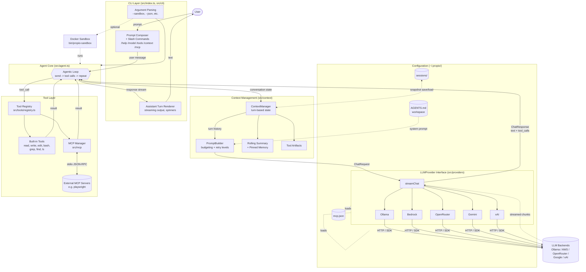

# High-Level Architecture

A high-level data flow diagram of the propio-agent project.

## Reading guide

The main loop in one sentence: User prompt → `Agent` appends it to `ContextManager` → `PromptBuilder` assembles a `ChatRequest` → the selected `LLMProvider` streams a response → if the response contains tool calls, `Agent` dispatches them to built-in tools or MCP servers and feeds results back into the loop → otherwise the final text streams back to the user.

## Key components

- **CLI Layer** (`src/index.ts`, `src/cli/`) — argument parsing, prompt composer, slash commands, streaming output renderer.
- **Agent Core** (`src/agent.ts`) — drives the agentic loop: send → tool calls → repeat → final response.
- **Context Management** (`src/context/`) — `ContextManager` owns turn state; `PromptBuilder` assembles provider payloads with budgeting and retry levels; tool outputs stored as artifacts; older history compacted via rolling summary plus pinned memory.
- **LLMProvider Interface** (`src/providers/`) — single `streamChat()` method abstracts five backends (Ollama, Bedrock, OpenRouter, Gemini, xAI). Provider-agnostic types in `types.ts`.
- **Tool Layer** (`src/tools/`, `src/mcp/`) — registry of built-in tools plus an MCP manager that proxies external stdio MCP servers; both return results into the agent loop the same way.
- **Configuration** (`~/.propio/`) — `providers.json`, `mcp.json`, session snapshots; workspace-local `AGENTS.md` feeds the system prompt.
- **Sandbox Mode** (`bin/propio-sandbox`) — optional Docker wrapper that runs the agent with filesystem access scoped to the current working directory.
