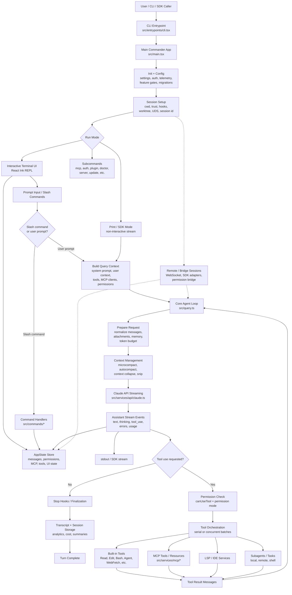

# Mature Project Data Flow

A high-level Mermaid diagram of how the mature project works, focused on startup, interaction modes, the core query loop, tool execution, and persistence.

## Reading Guide

`src/main.tsx` is the front door: it parses CLI arguments, initializes configuration, and runs session setup. From there, the program chooses an interactive React Ink REPL, a headless print/SDK path, or a subcommand path.

The main behavioral loop lives in `src/query.ts`. It prepares messages and context, handles compaction, streams from the Claude API, executes requested tools, feeds tool results back into the model, and repeats until the assistant returns a final answer.
