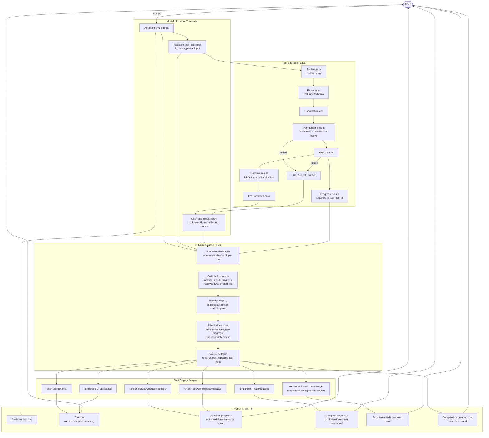
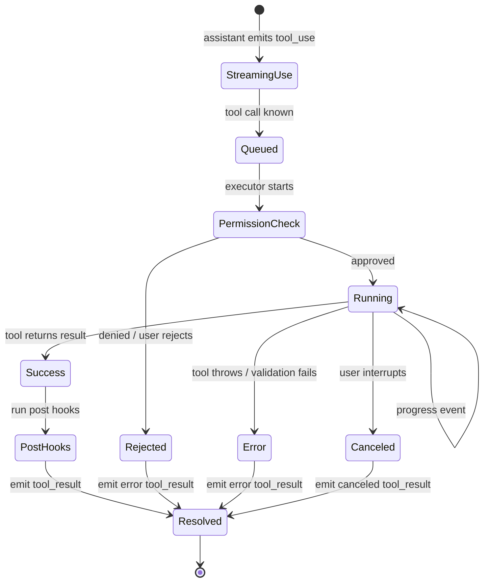

# Tool Call UI Output Flow

A Mermaid diagram of the mature tool-call UI pattern described in `docs/tool-call-ui-output.md`. The key idea is that provider messages, tool execution events, and rendered UI rows are related by tool call ID, but they are not the same data structure.

## State View

## Reading Guide

The provider transcript remains faithful to the model protocol: assistant text, assistant `tool_use`, and user `tool_result` blocks.

The execution layer owns running the tool and producing progress, structured UI-facing results, and failure states.

The UI normalization layer joins those pieces by `tool_use_id`, hides protocol noise, reorders results under their matching calls, and optionally groups repeated or low-value rows.

The display adapter is where each tool translates raw execution data into human-facing UI. This is why a file read can show "Read 86 lines" while the model still receives the actual file contents.
