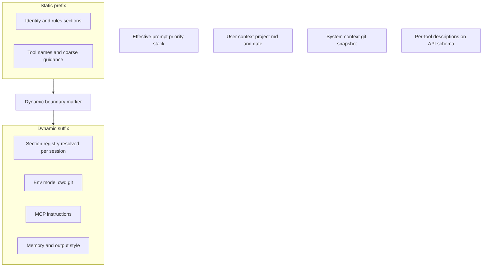

# Dynamic and Robust System Prompt Upgrade Plan

## Overview

This document outlines the design and implementation plan to update the Propio agent's system prompt architecture. The goal is to transition from a static system prompt to a highly structured, modular, and dynamic system prompt that adapts to the execution environment, workspace status, and real-time execution context.

Patterns in this plan draw on prior art from mature coding-agent stacks (layered sections, static/dynamic split, separate tool-schema guidance). The published doc describes those patterns generically; it does not name or link any specific reference product or repository.

---

## Current State

The sections below describe **shipped behavior today** versus what this plan proposes. Treat this as an upgrade path, not a description of current runtime.

| Area | This plan proposes | Code today |
| ---- | ------------------ | ---------- |
| Default prompt | `compileSystemPrompt()` in a dedicated prompt module, with `src/defaultSystemPrompt.ts` kept as a thin compatibility export | Static string in `src/defaultSystemPrompt.ts` |
| Prompt representation | `CompiledSystemPrompt` (`readonly` sections with stable IDs) + `SystemPromptSectionRegistry`; `joinSections()` at the API boundary | Single stored `string` on the agent, composed once at construct |
| AGENTS.md | Dedicated section inside the compiled template | Prepended once at construct via `composeSystemPrompt()` in `src/agentsMd.ts`, called from `src/agent.ts` |
| Per-turn extras | Documented as intentional tail blocks | `getEffectiveSystemPrompt()` in `src/agent.ts` appends skill discovery from `renderSkillDiscoveryBlock()` in `src/skills/discovery.ts` |
| Context assembly | Context provider + compiler only for the stable system core | `PromptBuilder.composeSystemBase()` in `src/context/promptBuilder.ts` already stacks system prompt + pinned memory + invoked skills |
| Env / git / time | Injected in a runtime environment section, refreshed per turn | Not injected anywhere yet |

---

## Objectives

- **Increase environmental awareness**: Provide the agent with real-time context (OS, cwd, shell, datetime, timezone, Node version, git branch/dirty state when applicable) so paths and shell commands are generated with fewer errors.
- **Structural improvements**: Restructure the prompt into clearly demarcated Markdown sections (`#` headers) so models can parse guidelines selectively.
- **Adaptability**: Refresh volatile context each turn while keeping persona and operational rules stable.
- **Preserve project guidance**: Integrate `AGENTS.md` in a dedicated, highly visible section (not an opaque prepend).
- **Honor existing assembly**: Skill discovery and `PromptBuilder` memory/skill blocks already exist; the new compiler must not duplicate them.

---

## Reference Implementation Patterns

Mature coding-agent stacks typically compose the system prompt in layers. The pipeline below summarizes common structure without tying Propio to any particular product.



The diagram summarizes common patterns. In this phase for Propio, MCP-specific prose is not added to the system prompt; connected MCP tools continue to surface through provider tool schemas.

### Pattern comparison

| Pattern | What mature stacks typically do | Propio takeaway |
| ------- | -------------------------------- | --------------- |
| Core assembler | Build system prompt as ordered sections (`string[]` or equivalent) | `compileSystemPrompt()` returns `CompiledSystemPrompt` with stable section IDs; `joinSections()` is the single join helper before existing `string` APIs |
| Static/dynamic split | Explicit boundary; session-specific conditionals **after** the boundary | Adopt volatile-after-stable ordering; registry memoizes static/session-stable sections, refreshes runtime env each turn |
| Section registry | Memoized sections vs per-turn cache-breaking sections | Adopt in this phase: memoize `coreIdentity`, `agentsMd`, static `toolUtilization` policy, and `responseFormatting`; refresh `runtimeEnvironment` as the volatile tail section |
| Priority merge | Override → agent → custom → default → append | Keep simple in this phase: custom `systemPrompt` / `setSystemPrompt()` replaces `coreIdentity` only, while AGENTS/tool/format/env tails still wrap around it; session metadata follows the same stable-core semantics |
| Volatile context channel | Git/status and project markdown merged at query time, not always in the system array | Runtime environment is the final compiled-core section; overflow uses `runtimeContextOverflowBlock` inside the system message when env section exceeds `SYSTEM_PROMPT_ENV_MAX_CHARS` |
| Tool docs split | Rich per-tool API descriptions; coarse tool policy in system prose; enabled names in volatile context | Align detailed behavior with tool `description` fields; list currently enabled built-in and MCP tool names in `runtimeEnvironment` |
| Provider cache | Cache breakpoints on static vs dynamic prompt prefixes | **Deferred** — section IDs prepare for breakpoints later; no `ChatRequest` changes in this phase |

### Patterns to adopt

1. **Layered composition** — static core + volatile tail, joined with `\n\n`.
2. **Named sections** — `# Title` markdown blocks; small `getXSection(ctx)` builders instead of one giant template string.
3. **`string[]` first-class sections** — stable section IDs (`coreIdentity`, `agentsMd`, `toolUtilization`, `responseFormatting`, `runtimeEnvironment`) on `CompiledSystemPrompt`.
4. **Section registry** — static sections built once per session; `agentsMd` invalidated when content source changes; `runtimeEnvironment` rebuilt or refreshed every `getEffectiveSystemPrompt()` call.
5. **`joinSections()`** — only boundary that produces the `string` passed to existing APIs (`systemPrompt: string` on `PromptBuildRequest` in `src/context/promptBuilder.ts`).
6. **Volatile vs. stable split** — refresh cheap env fields and enabled tools each turn; keep git cached and best-effort; keep persona and rules stable.
7. **Two-channel tool guidance** — static tool policy in the system prompt; currently enabled tool names in runtime context; behavioral detail in tool JSON schemas.
8. **Tail append for discovery** — keep skill discovery appended in `getEffectiveSystemPrompt()` so the stable prefix is not rewritten every turn (same idea as delta/attachment channels in mature stacks).

### Future enhancements

- Provider-level prompt cache scopes and cache metadata on `ChatRequest` (`src/providers/types.ts` has no cache fields today); wire providers when capabilities exist
- Attachments or delta channel for MCP or skill updates
- Feature-flag-driven alternate full prompts (subagent/coordinator variants)
- Multi-level override priority stack beyond `setSystemPrompt()`

`string[]` sections and section IDs are chosen now for structure and testability, not because provider cache APIs exist yet.

---

## Target Prompt Architecture

The compiled system prompt core (blocks 1–5) is built by `compileSystemPrompt()` via the section registry. Blocks 1–4 form the stable prefix; block 5 is the volatile compiled-core tail. Blocks 6–7 are **already implemented** elsewhere and must not be duplicated inside `defaultSystemPrompt.ts`.

```
+-------------------------------------------------------------+
| 1. CORE IDENTITY & OPERATIONAL RULES (static)              |
|    - Persona, exploration vs. implementation, confirmation  |
+-------------------------------------------------------------+
| 2. PROJECT INSTRUCTIONS — AGENTS.md (stable per session)   |
|    - Repo guidelines from loaded AGENTS.md content          |
+-------------------------------------------------------------+
| 3. TOOL UTILIZATION (static policy)                        |
|    - Tool-use policies; detailed behavior stays in schemas  |
+-------------------------------------------------------------+
| 4. RESPONSE FORMATTING (static)                              |
|    - Avoid markdown tables; concise summaries, etc.         |
+-------------------------------------------------------------+
| 5. RUNTIME ENVIRONMENT (dynamic, per turn)                 |
|    - OS, cwd, date/time/timezone, Node, shell               |
|    - Cached best-effort git branch/dirty state              |
|    - Currently enabled built-in and MCP tool names          |
+-------------------------------------------------------------+
| --- appended in Agent.getEffectiveSystemPrompt() ---        |
| 6. SKILL DISCOVERY (dynamic, bounded — existing)            |
+-------------------------------------------------------------+
| --- appended in PromptBuilder.composeSystemBase() ---       |
| 7. PINNED MEMORY + INVOKED SKILLS (existing)                |
+-------------------------------------------------------------+
```

### Runtime pipeline


Blocks 1–5 are produced as identified sections by the registry and compiler, then collapsed once via `joinSections()` before block 6 is appended (same tail-append strategy as today). The stable compiled prefix is ordered before the volatile runtime section so future provider prompt caching can reuse the maximum prefix. Blocks 6–7 are unchanged; the registry does not absorb skill discovery or pinned memory.

### Instruction priority

Core identity and operational rules take precedence over project instructions. `AGENTS.md` content guides repository-specific behavior, conventions, and constraints. Current user requests can narrow, direct, or add task-specific requirements unless they conflict with higher-priority operational rules or explicit project constraints.

Example: if `AGENTS.md` says to run `format:check` before commit and the user casually says to skip checks for a hotfix, the project constraint wins unless the user explicitly overrides that project policy.

### Assembly order at runtime

1. Build `SystemPromptContext` (per turn) and resolve sections via `SystemPromptSectionRegistry` + `compileSystemPrompt()` → blocks 1–5 as `CompiledSystemPrompt`
2. `joinSections()` → single system-prompt core string
3. `getEffectiveSystemPrompt()` → append block 6 (skill discovery)
4. `PromptBuilder.composeSystemBase()` → append block 7 (pinned memory, invoked skills)

---

## Implementation

### A. System prompt context (`src/prompt/systemPromptContext.ts`)

New module to gather environment details safely and return structured context:

```typescript
export interface SystemPromptContext {
  os: string;
  cwd: string;
  dateTime: string; // ISO + timezone
  nodeVersion: string;
  shell: string;
  gitBranch?: string;
  isGitDirty?: boolean;
  enabledToolNames: readonly string[];
}
```

- Runtime refresh: cheap fields (`cwd`, date/time, shell, Node version, enabled tool names) refresh per turn.
- Git probes: best-effort and cached with a short TTL; time out or fall back to the last known/empty git state rather than blocking prompt construction.
- `enabledToolNames`: from enabled built-in tool schemas plus connected MCP tool schemas at prompt-build time.

Prefer `src/prompt/` over `src/context/` so turn/history concerns stay in `src/context/`.

### B. Section builders and compiler (`src/prompt/compileSystemPrompt.ts`)

```typescript
export type SystemPromptSectionId =
  | "coreIdentity"
  | "agentsMd"
  | "toolUtilization"
  | "responseFormatting"
  | "runtimeEnvironment";

export interface CompiledSystemPrompt {
  readonly sections: ReadonlyArray<{
    id: SystemPromptSectionId;
    content: string;
  }>;
}

export function compileSystemPrompt(
  ctx: SystemPromptContext,
  options?: { agentsMdContent?: string; baseRules?: string },
  registry?: SystemPromptSectionRegistry,
): CompiledSystemPrompt;

export function joinSections(compiled: CompiledSystemPrompt): string;
```

- Move rules currently in the static string (exploration vs. implementation, confirmation, formatting) into named section builders (`getCoreIdentitySection`, `getRuntimeEnvironmentSection`, etc.).
- Treat `baseRules` as the core identity content. Custom `systemPrompt` values and later `setSystemPrompt()` calls replace only `coreIdentity`; AGENTS.md, tool guidance, response formatting, runtime environment, skill discovery, and memory/skill tails still wrap around the custom core.
- Omit empty sections (e.g. skip `agentsMd` when content is blank).
- `toolUtilization` contains static policy only. Put currently enabled built-in tool names and connected MCP tool names in `runtimeEnvironment` so `enableTool()`, `disableTool()`, `addTool()`, and MCP connection changes cannot stale a memoized static section.
- `src/defaultSystemPrompt.ts` becomes a thin export for CLI/backward compatibility: `joinSections(compileSystemPrompt(emptyCtx))` or a documented default snapshot.

### C. Section registry (`src/prompt/systemPromptSectionRegistry.ts`)

- Memoize by section ID:
  - `coreIdentity`: keyed by `baseRules`
  - `agentsMd`: keyed by content hash
  - `toolUtilization`: static policy prose only
  - `responseFormatting`: static prose only
- Rebuild or refresh `runtimeEnvironment` independently on each compile call (per-turn volatile data).
- `invalidate()` triggers (align with `src/agent.ts` lifecycle):
  - New `Agent` instance / new session identity
  - `setSystemPrompt()` with different base rules invalidates only the core identity/custom core cache
  - AGENTS.md reload or changed `agentsMdContent` invalidates only the AGENTS section cache
  - Future explicit session-reset APIs should call registry invalidation, but no such API exists today
- Tests: cache hit for static sections, miss after invalidation, fresh env section every turn.

### D. AGENTS.md placement (breaking change)

- Stop prepending via `composeSystemPrompt()` at `Agent` construction time.
- Pass `agentsMdContent` into `compileSystemPrompt()` as section `agentsMd`.
- Remove `composeSystemPrompt()` from the production path. Because it is not a package-level public export, prefer deleting it after tests migrate to compiler/join assertions; if kept temporarily, mark it deprecated and do not call it from `Agent`.
- Update `src/agent.ts` constructor and tests in `src/__tests__/agent.test.ts` and `src/__tests__/agentsMd.test.ts`.
- **Breaking change**: order becomes explicit sections, not `agentsMdContent + "\n\n" + defaultPrompt`. Tests that assert prepend order (e.g. `agent.test.ts` ~1574–1599) must expect AGENTS.md inside the compiled template after the core identity section.

### E. Agent loop (`src/agent.ts`)

- Store `agentsMdContent`, optional `baseRules`, and a `SystemPromptSectionRegistry` instance (or factory) on the agent — not only a final joined string.
- `setSystemPrompt(prompt)` updates `baseRules` / custom core identity content instead of replacing the fully composed prompt. The next prompt build recompiles with the custom core plus the unchanged wrapper sections.
- `exportSession()` should persist `baseRules` / custom core identity content (or the default core when unset), not call `getEffectiveSystemPrompt()`.
- In `getEffectiveSystemPrompt()`:
  1. Build fresh `SystemPromptContext`
  2. `compileSystemPrompt(ctx, options, registry)` → `CompiledSystemPrompt`
  3. `joinSections(compiled)` → core string
  4. Append skill discovery block (unchanged string concat for block 6)
- Pass result to `ContextManager` / `PromptBuilder` as today.

Document expected cost: small synchronous env reads per turn; git best-effort and cached; registry avoids rebuilding static section prose every turn.

Suggested defaults:

- `SYSTEM_PROMPT_ENV_MAX_CHARS`: `2000`
- Git cache TTL: `5 seconds`
- Git probe timeout: `150 ms` total for branch/dirty-state collection

### F. Git overflow channel (conditional)

- Default: git branch and dirty state live in `runtimeEnvironment`, the final compiled-core section.
- If runtime env prose (including git detail) exceeds `SYSTEM_PROMPT_ENV_MAX_CHARS`, emit git/status via a new optional `runtimeContextOverflowBlock` on `PromptBuildRequest`.
- The env builder / compiler decides overflow and returns both the trimmed runtime environment section and overflow metadata. `Agent.buildPlan()` threads that overflow metadata through `ContextManager.buildPromptPlan()` into `PromptBuildRequest`.
- When overflow fires, omit the detailed git/status lines from `runtimeEnvironment`; at most keep a one-line pointer that detailed runtime context follows in the overflow block. Do not duplicate git/status in both places.
- `PromptBuilder.composeSystemBase()` appends `runtimeContextOverflowBlock` inside the single system message immediately after `request.systemPrompt` and before pinned memory / invoked skills. Do not use `extraUserInstruction`; overflow is context, not a user instruction.
- Typical repos should not hit this path; add tests for the overflow branch when implemented.

### G. Session/export compatibility

- Preserve persisted `metadata.systemPrompt` compatibility in `exportSession()` by storing the stable core/custom prompt that callers already expect.
- Do not persist a per-turn compiled prompt snapshot as the authoritative system prompt; it contains volatile runtime context.
- UI/session inspection should treat `metadata.systemPrompt` as the stable core/custom prompt, not as the exact model system message. If exact compiled prompts are exposed later, make them diagnostic-only.
- Future session metadata can add explicit fields for `coreIdentity` / custom base rules and compiled prompt diagnostics, but this phase should avoid changing snapshot semantics unless the persistence schema is intentionally versioned.

### H. Provider prompt cache (deferred)

Section IDs and `CompiledSystemPrompt` are structured so static vs dynamic boundaries can map to provider cache breakpoints later. This phase does **not** extend `ChatRequest`, provider capabilities, or provider adapters for cache metadata.

---

## Verification and testing

| Test file | Coverage |
| --------- | -------- |
| `src/prompt/__tests__/systemPromptContext.test.ts` | Context fields, non-git fallback, timeout/failure paths |
| `src/prompt/__tests__/compileSystemPrompt.test.ts` | Section IDs, order, empty `agentsMd` omission, enabled tool names in runtime env, `joinSections()`, size budget |
| `src/prompt/__tests__/systemPromptSectionRegistry.test.ts` | Memoization, invalidation triggers, per-turn env refresh |
| `src/prompt/__tests__/gitOverflow.test.ts` | Overflow threshold routes git out of the runtime environment section and into `runtimeContextOverflowBlock` (when F is implemented) |
| `src/__tests__/agent.test.ts`, `src/__tests__/agentsMd.test.ts` | AGENTS.md inside the compiled core; `getEffectiveSystemPrompt()` uses registry + join; old prepend assertions become section-order / contains assertions |
| `src/__tests__/integration.test.ts` | Custom `systemPrompt` no longer equals the full system message; update assertions from exact equality to “contains custom core” plus wrapper-section checks |
| `src/context/__tests__/persistence.test.ts` / session tests | `exportSession()` preserves stable core/custom prompt metadata and does not persist volatile compiled runtime context |

After implementation: `npm test`, `npm run build`, and spot-check that per-turn refresh does not add noticeable latency.

---

## Integration Points

| Component | Role |
| --------- | ---- |
| `src/index.ts` | Supplies default system prompt to new sessions via `joinSections(compileSystemPrompt(...))` |
| `src/agent.ts` | `getEffectiveSystemPrompt()` — per-turn context, registry-backed compile, join, skill discovery tail |
| `src/context/contextManager.ts` | Thread optional `runtimeContextOverflowBlock` from agent prompt build options into `PromptBuildRequest` |
| `src/context/promptBuilder.ts` | `composeSystemBase()` — optional runtime overflow after system prompt, then pinned memory and invoked skills |
| `src/agentsMd.ts` | Loads `AGENTS.md`; content fed into compiler, not prepended at construct |
| `src/context/persistence.ts` / session export | Preserve `metadata.systemPrompt` compatibility with stable core/custom prompt semantics |
| `src/skills/discovery.ts` | `renderSkillDiscoveryBlock()` — unchanged tail append |
| `src/tools/registry.ts` / MCP manager | Tool `description` fields remain the detailed channel; runtime env lists currently enabled built-in and connected MCP tool names |

---

## Non-Goals

- Provider prompt-cache scopes and cache metadata on requests
- Provider-specific cache headers or billing metadata from reference stacks
- Attachments/delta channel for MCP or skill discovery
- Multi-level system-prompt override stack (coordinator/agent/subagent variants)
- Duplicating skill discovery or pinned memory inside `compileSystemPrompt()`
- MCP-specific system-prompt prose; MCP remains represented through tool schemas and enabled tool names in runtime context

---

## Next Steps

1. **Approval** — Confirm this design (stable-prefix ordering, runtime env as volatile tail, AGENTS.md section move, custom core semantics, `CompiledSystemPrompt` + section registry, conditional git overflow).
2. **Implementation** (ordered):
   - Add `src/prompt/systemPromptContext.ts`
   - Add `src/prompt/compileSystemPrompt.ts` with section builders, `compileSystemPrompt()`, and `joinSections()`; keep `src/defaultSystemPrompt.ts` as a thin compatibility export
   - Add `src/prompt/systemPromptSectionRegistry.ts`
   - Wire `src/agent.ts` for registry-backed per-turn compile + existing tails
   - Implement git overflow path (F) if needed for budget safety
   - Update tests listed above
3. **Validation** — `npm run build`, `npm test`, manual check of prompt content and turn latency
4. **Release note** — Call out that AGENTS.md is now an explicit section after core identity rather than a raw prepend, which may slightly change prompt salience in repo-heavy workflows.
